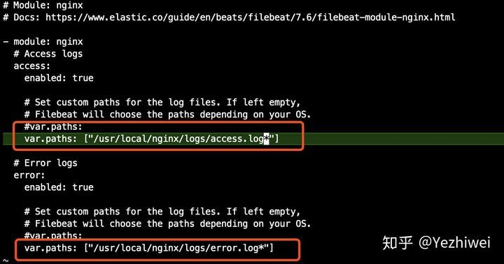

# BZKLEK 架設實戰

## ELK Stack 7.12 解壓安裝

### Elasticsearch 安裝

`cd /usr/local/`

`curl -L -O https://artifacts.elastic.co/downloads/elasticsearch/elasticsearch-7.12.0-linux-x86_64.tar.gz`

 `tar -xvf elasticsearch-7.12.0-linux-x86_64.tar.gz`

`rm elasticsearch-7.12.0-linux-x86_64.tar.gz`

`mv elasticsearch-7.12.0-linux-x86_64/elasticsearch`

`ln -s /usr/local/elasticsearch elasticsearch`

* 编辑 ./config/elasticsearch.yml

`vim /usr/local/elasticsearch-7.12.0/config/elasticsearch.yml`

```text
# 添加或修改
node.name: node-1
#network.host:0.0.0.0 代表開給外網連線
network.host: 0.0.0.0
http.port: 9200
cluster.initial_master_nodes: ["node-1"]
```

* 修改文件包含限制一个进程可以拥有的VMA\(虚拟内存区域\)的数量配置，编辑 /etc/sysctl.conf

`vim /etc/sysctl.conf`

```text
# 添加或修改
# sudo sysctl -p 使修改生效
vm.max_map_count = 262144
```

* 修改 ECS 安全组，放行 9200 端口

`ufw allow in 9200`

`ufw allow in 9300`

查看目前防火牆規則


```text
sudo ufw status # 查看目前防火牆規則
sudo ufw status numbered #以數字排列目前防火牆規則
```

*  創建帳戶

`adduser elasticsearch`

* 将对应的文件夹权限赋给该用户

`chown -R elasticsearch /usr/local/elasticsearch/elasticsearch-7.12.0`

* 切换至elasticsearch用户 

`su elasticsearch` 

* 进入启动目录启动 /usr/local/elasticsearch-7.12.0/bin 使用后台启动方式

`./elasticsearch -d`

* 測試是否成功啟動

 `curl -X GET "localhost:9200"`


### Kibana 安裝

`cd /usr/local`

`curl -L -O https://artifacts.elastic.co/downloads/kibana/kibana-7.12.0-linux-x86_64.tar.gz`

`tar -xvf kibana-7.12.0-linux-x86_64.tar.gz`

`rm kibana-7.12.0-linux-x86_64.tar.gz`

`mv kibana-7.12.0-linux-x86_64/ kibana`

`ln -s /usr/local/kibana kibana`

* 設定檔設定

`vim config/kibana.yml`

```text
server.port: 5601
server.host: "123.456.789.0"
server.name: "kibana-test"
elasticsearch.hosts: ["http://10.10.0.8:9200"]
# kibana会将部分数据写入es，这个是ex中索引的名字
kibana.index: ".kibana"
```

*  創建帳戶

`adduser kibana`

* 将对应的文件夹权限赋给该用户

`chown -R kibana /usr/local/kibana`

* 切换至kibana用户 

`su kibana`

* 进入启动目录启动 /usr/local/kibana/bin 使用后台启动方式

`nobhub ./kibana &`

* 測試是否成功啟動

 `http://localhost:5601`

### Logstash 安裝

* 安裝

`cd /usr/local`

`curl -L -O https://artifacts.elastic.co/downloads/logstash/logstash-7.12.0-linux-x86_64.tar.gz`

`tar -xvf logstash-7.12.0-linux-x86_64.tar.gz`

`rm logstash-7.12.0-linux-x86_64.tar.gz`

`mv logstash-7.12.0-linux-x86_64/ logstash`

~~ln -s /usr/local/logstash logstash~~


*  創建帳戶

`adduser logstash`

* 将对应的文件夹权限赋给该用户

`chown -R logstash /usr/local/logstash`

* 切换至logstash用户 

`su logstash`

```text
#編輯設定檔案
vim /usr/local/logstash.conf
```

```text
#內容請複製貼上
# Sample Logstash configuration for creating a simple
# Beats -> Logstash -> Elasticsearch pipeline.

input{

    kafka{

        bootstrap_servers => "10.140.0.10:9092,10.140.0.11:9092,10.140.0.12:9092"

        topics => ["nginx-logs"]

        codec => json

    }

}


output {

  elasticsearch {

        hosts => ["http://10.140.0.6:9200"]

        index => "nginx-logs"

       #index => "%{[@metadata][beat]}-%{[@metadata][version]}"

#       user => "elastic"

#       password => "P@ssw0rd@Data!"

  }

}


```

* 进入启动目录启动 /usr/local/logstash/bin 使用后台启动方式

`nohup bin/logstash -f config/logstash.conf &`

* 確認是否成功啟動

```text
[1] 17978
root@logstash1:/usr/local/logstash# Using bundled JDK: /usr/local/logstash/jdk
OpenJDK 64-Bit Server VM warning: Option UseConcMarkSweepGC was deprecated in version 9.0 and will likely be remove
d in a future release.
Sending Logstash logs to /usr/local/logstash/logs which is now configured via log4j2.properties
[2021-04-19T01:17:47,801][INFO ][logstash.runner          ] Log4j configuration path used is: /usr/local/logstash/c
onfig/log4j2.properties
[2021-04-19T01:17:47,834][INFO ][logstash.runner          ] Starting Logstash {"logstash.version"=>"7.12.0", "jruby
.version"=>"jruby 9.2.13.0 (2.5.7) 2020-08-03 9a89c94bcc OpenJDK 64-Bit Server VM 11.0.10+9 on 11.0.10+9 +indy +jit
 [linux-x86_64]"}
[2021-04-19T01:17:48,799][WARN ][logstash.config.source.multilocal] Ignoring the 'pipelines.yml' file because modul
es or command line options are specified
[2021-04-19T01:17:50,368][INFO ][logstash.agent           ] Successfully started Logstash API endpoint {:port=>9600
}
[2021-04-19T01:17:51,843][INFO ][org.reflections.Reflections] Reflections took 76 ms to scan 1 urls, producing 23 k
eys and 47 values 
[2021-04-19T01:17:53,283][INFO ][logstash.outputs.elasticsearch][main] Elasticsearch pool URLs updated {:changes=>{
:removed=>[], :added=>[http://10.140.0.6:9200/]}}
[2021-04-19T01:17:53,635][WARN ][logstash.outputs.elasticsearch][main] Restored connection to ES instance {:url=>"h
ttp://10.140.0.6:9200/"}
[2021-04-19T01:17:53,710][INFO ][logstash.outputs.elasticsearch][main] ES Output version determined {:es_version=>7
}
[2021-04-19T01:17:53,715][WARN ][logstash.outputs.elasticsearch][main] Detected a 6.x and above cluster: the `type`
 event field won't be used to determine the document _type {:es_version=>7}
[2021-04-19T01:17:53,784][INFO ][logstash.outputs.elasticsearch][main] New Elasticsearch output {:class=>"LogStash:
:Outputs::ElasticSearch", :hosts=>["http://10.140.0.6:9200"]}
[2021-04-19T01:17:53,948][INFO ][logstash.outputs.elasticsearch][main] Using a default mapping template {:es_versio
n=>7, :ecs_compatibility=>:disabled}
[2021-04-19T01:17:54,021][INFO ][logstash.javapipeline    ][main] Starting pipeline {:pipeline_id=>"main", "pipelin
e.workers"=>2, "pipeline.batch.size"=>125, "pipeline.batch.delay"=>50, "pipeline.max_inflight"=>250, "pipeline.sour
ces"=>["/usr/local/logstash/config/logstash.conf"], :thread=>"#<Thread:0xac94cdd run>"}
[2021-04-19T01:17:54,062][INFO ][logstash.outputs.elasticsearch][main] Attempting to install template {:manage_temp
late=>{"index_patterns"=>"logstash-*", "version"=>60001, "settings"=>{"index.refresh_interval"=>"5s", "number_of_sh
ards"=>1}, "mappings"=>{"dynamic_templates"=>[{"message_field"=>{"path_match"=>"message", "match_mapping_type"=>"st
ring", "mapping"=>{"type"=>"text", "norms"=>false}}}, {"string_fields"=>{"match"=>"*", "match_mapping_type"=>"strin
g", "mapping"=>{"type"=>"text", "norms"=>false, "fields"=>{"keyword"=>{"type"=>"keyword", "ignore_above"=>256}}}}}]
, "properties"=>{"@timestamp"=>{"type"=>"date"}, "@version"=>{"type"=>"keyword"}, "geoip"=>{"dynamic"=>true, "prope
rties"=>{"ip"=>{"type"=>"ip"}, "location"=>{"type"=>"geo_point"}, "latitude"=>{"type"=>"half_float"}, "longitude"=>
{"type"=>"half_float"}}}}}}}
[2021-04-19T01:17:55,597][INFO ][logstash.javapipeline    ][main] Pipeline Java execution initialization time {"sec
onds"=>1.57}
[2021-04-19T01:17:55,646][INFO ][logstash.inputs.beats    ][main] Starting input listener {:address=>"0.0.0.0:5044"
}
[2021-04-19T01:17:55,670][INFO ][logstash.javapipeline    ][main] Pipeline started {"pipeline.id"=>"main"}
[2021-04-19T01:17:55,752][INFO ][logstash.agent           ] Pipelines running {:count=>1, :running_pipelines=>[:mai
n], :non_running_pipelines=>[]}
[2021-04-19T01:17:55,954][INFO ][org.logstash.beats.Server][main][d30cec8718b4eec2fe086d75154440802a7f35a6572519d10
06ee383031ddb4c] Starting server on port: 5044
```

### Filebeat 安裝

* 安裝

`cd /usr/local`

`curl -L -O https://artifacts.elastic.co/downloads/beats/filebeat/filebeat-7.12.0-linux-x86_64.tar.gz`

`tar -xvf filebeat-7.12.0-linux-x86_64.tar.gz`

`rm filebeat-7.12.0-linux-x86_64.tar.gz`

`mv filebeat-7.12.0-linux-x86_64/ filebeat`

`ln -s /usr/local/filebeat filebeat`

*  創建帳戶

`adduser filebeat`

* 将对应的文件夹权限赋给该用户

`chown -R filebeat /usr/local/filebeat`

* 切换至filebeat用户 

`su filebeat`

* Config 設定config

```text
vim /usr/local/filebeat/nginx.yml
```

內容:

```text
    #    include_lines: ['content']

    paths: /var/log/nginx/access.log

    tail_files: true

    fields:
           topicname: nginx-logs

    scan_frequency: 5s

    #開啟debug模式

    #logging.level: debug

    #logging.selectors: [publish]

    #logging.to_files: true

output.kafka:

  enabled: true

  hosts: ["10.140.0.10:9092","10.140.0.11:9092","10.140.0.12:9092"]

  topic: "nginx-logs"

  partition.hash:

  reachable_only: true

  compression: gzip

  max_message_bytes: 1000000

  required_acks: 1

  logging.to_files: true

```

* 进入启动目录启动 /usr/local/logstash/bin 使用后台启动方式注意後面可以帶入不同設定檔檔名

`nohup ./filebeat -e -c nginx.yml &`

* 測試是否成功啟動

`ps -aux | grep filebeat`


## Kafka 系列—— 基于 ZooKeeper 搭建 Kafka 偽高可用集群\[三個節點在同一台主機\]

Zookeeper 依靠java運行需先安裝Openjava-11-jdk 套件

### Zookeeper集群搭建

为保证集群高可用，Zookeeper 集群的节点数最好是奇数，最少有三个节点，所以这里搭建一个三个节点的集群。

#### 1.1 下载 & 解压

下载对应版本 Zookeeper，这里我下载的版本 `3.6.3`。官方下载地址：[archive.apache.org/dist/zookee…](https://archive.apache.org/dist/zookeeper/)

```text
# 下载
wget https://downloads.apache.org/zookeeper/zookeeper-3.6.3/apache-zookeeper-3.6.3-bin.tar.gz
# 解压
tar -zxvf apache-zookeeper-3.6.3-bin.tar.gz
复制代码
```

#### 1.2 修改配置

拷贝三份 zookeeper 安装包。分别进入安装目录的 `conf` 目录，拷贝配置样本 `zoo_sample.cfg` 为 `zoo.cfg` 并进行修改，修改后三份配置文件内容分别如下：

zookeeper01 配置：

```text
tickTime=2000
initLimit=10
syncLimit=5
dataDir=/usr/local/zookeeper/data/01
dataLogDir=/usr/local/zookeeper/log/01
clientPort=2181

# server.1 这个1是服务器的标识，可以是任意有效数字，标识这是第几个服务器节点，这个标识要写到dataDir目录下面myid文件里
# 指名集群间通讯端口和选举端口
server.1=127.0.0.1:2287:3387
server.2=127.0.0.1:2288:3388
server.3=127.0.0.1:2289:3389
复制代码
```

> 如果是多台服务器，则集群中每个节点通讯端口和选举端口可相同，IP 地址修改为每个节点所在主机 IP 即可。

zookeeper02 配置，与 zookeeper01 相比，只有 `dataLogDir`、`dataLogDir` 和 `clientPort` 不同：

```text
tickTime=2000
initLimit=10
syncLimit=5
dataDir=/usr/local/zookeeper/data/02
dataLogDir=/usr/local/zookeeper/log/02
clientPort=2182
server.1=127.0.0.1:2287:3387
server.2=127.0.0.1:2288:3388
server.3=127.0.0.1:2289:3389
复制代码
```

zookeeper03 配置，与 zookeeper01，02 相比，也只有 `dataLogDir`、`dataLogDir` 和 `clientPort` 不同：

```text
tickTime=2000
initLimit=10
syncLimit=5
dataDir=/usr/local/zookeeper/data/03
dataLogDir=/usr/local/zookeeper/log/03
clientPort=2183
server.1=127.0.0.1:2287:3387
server.2=127.0.0.1:2288:3388
server.3=127.0.0.1:2289:3389
复制代码
```

> 配置参数说明：
>
> * **tickTime**：用于计算的基础时间单元。比如 session 超时：N\*tickTime；
> * **initLimit**：用于集群，允许从节点连接并同步到 master 节点的初始化连接时间，以 tickTime 的倍数来表示；
> * **syncLimit**：用于集群， master 主节点与从节点之间发送消息，请求和应答时间长度（心跳机制）；
> * **dataDir**：数据存储位置；
> * **dataLogDir**：日志目录；
> * **clientPort**：用于客户端连接的端口，默认 2181

#### 1.3 标识节点

分别在三个节点的数据存储目录下新建 `myid` 文件,并写入对应的节点标识。Zookeeper 集群通过 `myid` 文件识别集群节点，并通过上文配置的节点通信端口和选举端口来进行节点通信，选举出 leader 节点。

创建存储目录：

```text
# dataDir
mkdir -vp  /usr/local/zookeeper/data/01
# dataDir
mkdir -vp  /usr/local/zookeeper/data/02
# dataDir
mkdir -vp  /usr/local/zookeeper/data/03
复制代码
```

创建并写入节点标识到 `myid` 文件：

```text
#server1
echo "1" > /usr/local/zookeeper/data/01/myid
#server2
echo "2" > /usr/local/zookeeper/data/02/myid
#server3
echo "3" > /usr/local/zookeeper/data/03/myid
复制代码
```

#### 1.4 启动集群

分别启动三个节点：

```text
# 启动节点1
/usr/local/zookeeper/bin/zkServer.sh start
# 启动节点2
/usr/local/zookeeper/bin/zkServer.sh start
# 启动节点3
/usr/local/zookeeper/bin/zkServer.sh start
复制代码
```

#### 1.5 集群验证

使用 jps 查看进程，并且使用 `zkServer.sh status` 查看集群各个节点状态。如图三个节点进程均启动成功，并且两个节点为 follower 节点，一个节点为 leader 节点。



### Kafka集群搭建

#### 2.1 下载解压

Kafka 安装包官方下载地址：[kafka.apache.org/downloads](http://kafka.apache.org/downloads) ，本用例下载的版本为 `2.8.0`，下载命令：

```text
# 下载
wget https://www-eu.apache.org/dist/kafka/2.8.0/kafka_2.12-2.8.0.tgz
# 解压
tar -xzf kafka_2.12-2.8.0.tgz
复制代码
```

> 这里 j 解释一下 kafka 安装包的命名规则：以 `kafka_2.12-2.2.0.tgz` 为例，前面的 2.12 代表 Scala 的版本号（Kafka 采用 Scala 语言进行开发），后面的 2.2.0 则代表 Kafka 的版本号。

#### 2.2 拷贝配置文件

进入解压目录的 `config` 目录下 ，拷贝三份配置文件：

```text
# cp server.properties server-1.properties
# cp server.properties server-2.properties
# cp server.properties server-3.properties
复制代码
```

#### 2.3 修改配置

分别修改三份配置文件中的部分配置，如下：

server-1.properties：

```text
# The id of the broker. 集群中每个节点的唯一标识
broker.id=1
# 监听地址
listeners=PLAINTEXT://10.140.0.10:9092
# 数据的存储位置
log.dirs=/usr/local/kafka-logs/00
# Zookeeper连接地址
zookeeper.connect=10.140.0.10:2181,10.140.0.11:2181,10.140.0.12:2181
复制代码
```

server-2.properties：

```text
broker.id=2
listeners=PLAINTEXT://10.140.0.11:9092
log.dirs=/usr/local/kafka-logs/01
zookeeper.connect=10.140.0.10:2181,10.140.0.11:2181,10.140.0.12:2181
复制代码
```

server-3.properties：

```text
broker.id=3
listeners=PLAINTEXT://10.140.0.12:9092
log.dirs=/usr/local/kafka-logs/02
zookeeper.connect=10.140.0.10:2181,10.140.0.11:2181,10.140.0.12:2181
复制代码
```

这里需要说明的是 `log.dirs` 指的是数据日志的存储位置，确切的说，就是分区数据的存储位置，而不是程序运行日志的位置。程序运行日志的位置是通过同一目录下的 `log4j.properties` 进行配置的。

### Kafka 集群指令

#### 2.4 启动集群

分别指定不同配置文件，启动三个 Kafka 节点。启动后可以使用 jps 查看进程，此时应该有三个 zookeeper 进程和三个 kafka 进程。

```text
nohup bin/kafka-server-start.sh config/server-1.properties &
nohup bin/kafka-server-start.sh config/server-2.properties &
nohup bin/kafka-server-start.sh config/server-3.properties &
复制代码
```

#### 2.5 创建测试主题

```text
# 建立topic
/usr/local/kafka/bin/kafka-topics.sh --create --bootstrap-server 10.140.0.10:9092,10.140.0.11:9092,10.140.0.12:9092 --topic topicname test --partitions 3 --replication-factor 3
```

```text
# 獲取toppid
/usr/local/kafka/bin/kafka-topics.sh --describe --bootstrap-server 10.140.0.10:9092,10.140.0.11:9092,10.140.0.12:9092 --topic my-replicated-topic
```

```text
# 刪除topic
/usr/local/kafka/bin/kafka-topics.sh --delete --bootstrap-server 10.140.0.10:9092,10.140.0.11:9092,10.140.0.12:9092 --topic kafkatest
```

```text
# 你可以通过命令来查看所有topic
/usr/local/kafka/bin/kafka-topics.sh --bootstrap-server 10.140.0.10:9092,10.140.0.11:9092,10.140.0.12:9092 --list
```

### Kafka 狀態查詢方式


zookeeper 是 kafka 的分散式協調系統，在 kafka 上多個節點間需要協調的內容，例如：彼此節點的ID，位置與當前狀態，或是跨節點 topic 的設定與狀態。取名叫做 zookeeper 就是在協調混亂的分散式系統，,裡面各種不同種類的服務都要協調，象個動物園管  
理員。[Zookeeper 的官方文件](https://zookeeper.apache.org/doc/r3.3.3/zookeeperAdmin.html) 有更詳細的說明。

Kafka 的節點資訊，與當前狀態，是放在 zookeeper 上，我們可以透過以下指令取得

```text
# 首先先取得 zkCli 的 cli，這個只有連進任何一台 zookeeper 內部都有
kubectl exec -it kafka-0-zookeeper-0 --container kafka-broker bash

# 由於是在 Pod 內部，直接 localhost 詢問本地
/usr/bin/zkCli.sh -server localhost:2181

Connecting to localhost:2181
2019-09-25 15:02:36,089 [myid:] - INFO  [main:Environment@100] - Client environment:zookeeper.version=3.4.10-39d3a4f269333c922ed3db283be479f9deacaa0f, built on 03/23/2017 10:13 GMT
2019-09-25 15:02:36,096 [myid:] - INFO  [main:Environment@100] - Client environment:host.name=kafka-0-zookeeper-0.kafka-0-zookeeper-headless.default.svc.cluster.local
2019-09-25 15:02:36,096 [myid:] - INFO  [main:Environment@100] - Client environment:java.version=1.8.0_131
2019-09-25 15:02:36,100 [myid:] - INFO  [main:Environment@100] - Client environment:java.vendor=Oracle Corporation
2019-09-25 15:02:36,100 [myid:] - INFO  [main:Environment@100] - Client environment:java.home=/usr/lib/jvm/java-8-openjdk-amd64/jre
2019-09-25 15:02:36,100 [myid:] - INFO  [main:Environment@100] - Client environment:java.class.path=/usr/bin/../build/classes:/usr/bin/../build/lib/*.jar:/usr/bin/../share/zookeeper/zookeeper-3.4.10.jar:/usr/bin/../share/zookeeper/slf4j-log4j12-1.6.1.jar:/usr/bin/../share/zookeeper/slf4j-api-1.6.1.jar:/usr/bin/../share/zookeeper/netty-3.10.5.Final.jar:/usr/bin/../share/zookeeper/log4j-1.2.16.jar:/usr/bin/../share/zookeeper/jline-0.9.94.jar:/usr/bin/../src/java/lib/*.jar:/usr/bin/../etc/zookeeper:
2019-09-25 15:02:36,100 [myid:] - INFO  [main:Environment@100] - Client environment:java.library.path=/usr/java/packages/lib/amd64:/usr/lib/x86_64-linux-gnu/jni:/lib/x86_64-linux-gnu:/usr/lib/x86_64-linux-gnu:/usr/lib/jni:/lib:/usr/lib
2019-09-25 15:02:36,100 [myid:] - INFO  [main:Environment@100] - Client environment:java.io.tmpdir=/tmp
2019-09-25 15:02:36,100 [myid:] - INFO  [main:Environment@100] - Client environment:java.compiler=<NA>
2019-09-25 15:02:36,101 [myid:] - INFO  [main:Environment@100] - Client environment:os.name=Linux
2019-09-25 15:02:36,101 [myid:] - INFO  [main:Environment@100] - Client environment:os.arch=amd64
2019-09-25 15:02:36,101 [myid:] - INFO  [main:Environment@100] - Client environment:os.version=4.14.127+
2019-09-25 15:02:36,101 [myid:] - INFO  [main:Environment@100] - Client environment:user.name=zookeeper
2019-09-25 15:02:36,102 [myid:] - INFO  [main:Environment@100] - Client environment:user.home=/home/zookeeper
2019-09-25 15:02:36,102 [myid:] - INFO  [main:Environment@100] - Client environment:user.dir=/
2019-09-25 15:02:36,105 [myid:] - INFO  [main:ZooKeeper@438] - Initiating client connection, connectString=localhost:2181 sessionTimeout=30000 watcher=org.apache.zookeeper.ZooKeeperMain$MyWatcher@42110406
Welcome to ZooKeeper!
2019-09-25 15:02:36,160 [myid:] - INFO  [main-SendThread(localhost:2181):ClientCnxn$SendThread@1032] - Opening socket connection to server localhost/127.0.0.1:2181. Will not attempt to authenticate using SASL (unknown error)
JLine support is enabled
2019-09-25 15:02:36,374 [myid:] - INFO  [main-SendThread(localhost:2181):ClientCnxn$SendThread@876] - Socket connection established to localhost/127.0.0.1:2181, initiating session
2019-09-25 15:02:36,393 [myid:] - INFO  [main-SendThread(localhost:2181):ClientCnxn$SendThread@1299] - Session establishment complete on server localhost/127.0.0.1:2181, sessionid = 0x16d67baf1310001, negotiated timeout = 30000

WATCHER::

WatchedEvent state:SyncConnected type:None path:null
[zk: localhost:2181(CONNECTED) 0]
```

取得 kafka broker 資料

```text
# List root Nodes
$ ls /

[cluster, controller, controller_epoch, brokers, zookeeper, admin, isr_change_notification, consumers, log_dir_event_notification, latest_producer_id_block, config]

# Brokers 的資料節點
$ ls /brokers
[ids, topics, seqid]

# List /brokers/ids 得到三個 kafka broker
$ ls /brokers/ids
[0, 1, 2]

# 列出所有 topic 名稱
ls /brokers/topics
[ticker]
```

ticker 是上篇範利用到的 topic

簡單來說，zookeeper 存放這些狀態與 topic 的 metadata

* 儲存核心的狀態與資料，特別是 broker 萬一掛掉，也還需要維持的資料
* 協調工作，例如協助 broker 處理 quorum，紀錄 partition master 等

```text
# 離開 zkCli
quit                  
```


啟動filebeat:

```text
nohup ./filebeat -e -c filebeat.yml &
```


## 啟動命令

```text
#kafka
nohup JMX_PORT=9997 bin/kafka-server-start.sh config/server-1.properties &
#Elasticsearch-head
nohup grunt server &
#CMAK
nohup bin/cmak -Dconfig.file=conf/application.conf -Dhttp.port=9001 &
```

​

## 坑!!!!

### Q.filebeat Topic進入kafka 後只有 1個partition 1ReplicationFactor

#### kafka自动创建主题时指定分区数

可以通过修改kafka broker的server.properties配置文件的auto.create.topics.enable来开启主题自动创建功能，如果相关闭主题自动创建功能，设置auto.create.topics.enable=false即可，自动创建主题默认创建一个分区，为了提高kafka吞吐量，我们可以根据实际需要通过修改num.partitions这个配置来调整默认创建主题的分区数

num.partitions=50 就意味着默认为每个自动创建主题创建50个分区 

```text
############################ Topic setting ###########################################

auto.create.topics.enable = true
num.partitions=3
default.replication.factor=3
```


[https://github.com/alibaba/canal/issues/1982](https://github.com/alibaba/canal/issues/1982)



#### 手動建立分區

cd /usr/local/kafka/bin

touch topic-reassign.json

vim touch topic-reassign.json

```text
{"version":1,"topics":[{"topic":"topic_replica_test"}]}
```

`./kafka-reassign-partitions.sh --bootstrap-server 10.140.0.10:2181,10.140.0.11:2181,10.140.0.11:2181 --generate --topics-to-move-json-file topic-reassign.json --broker-list 1,2,3`

kafka-reassign-partitions --zookeeper 10.140.0.12:2181 --generate --topics-to-move-json-file topic-reassign.json --broker-list 1,2,3

[https://blog.csdn.net/lzufeng/article/details/81743521](https://blog.csdn.net/lzufeng/article/details/81743521)

分區重新分配 [https://blog.csdn.net/data2tech/article/details/108719342](https://blog.csdn.net/data2tech/article/details/108719342)

增加\(或减少\)Kafka topic的副本数   [https://blog.csdn.net/data2tech/article/details/108730452](https://blog.csdn.net/data2tech/article/details/108730452)


### F&gt;K&gt;L&gt;E&gt;K 無法看到index 在kibana上面

這個問題跟上面的問題有關西 如果Topic 只設定一個 1個partition 、1ReplicationFactor 則logstash 必須設定接受那一Broker 的topic 才行

## 設定檔備份

### Filebeat 與Kafka 對接

修改配置：   


```text
filebeat.inputs:

  - input.type: log

    enable: true

    #    include_lines: ['content']

    paths: /var/log/nginx/access.log

    tail_files: true

    fields:
           topicname: nginx-logs

    scan_frequency: 5s

    #開啟debug模式

    #logging.level: debug

    #logging.selectors: [publish]

    #logging.to_files: true

output.kafka:

  enabled: true

  hosts: ["10.140.0.10:9092","10.140.0.11:9092","10.140.0.12:9092"]

  topic: "nginx-logs"

  partition.hash:

  reachable_only: true

  compression: gzip

  max_message_bytes: 1000000

  required_acks: 1

  logging.to_files: true

```


###  Kafka 對接 Logstash &gt; ES


```text
input{

    kafka{

        bootstrap_servers => "10.140.0.10:9092,10.140.0.11:9092,10.140.0.12:9092"

        topics => ["nginx-logs"]

        codec => json

    }

}


output {
  elasticsearch {
  
    hosts => ["http://10.140.0.6:9200"]
    
     index => "nginx-logs"
     
#    index => "%{[@metadata][beat]}-%{[@metadata][version]}"

    user => "elastic"
    
    password => "P@ssw0rd@Data!"
    
  }
  
}

```

### ES 設定檔備份

### 1 Data node

```text
# ======================== Elasticsearch Configuration =========================
#
# NOTE: Elasticsearch comes with reasonable defaults for most settings.
#       Before you set out to tweak and tune the configuration, make sure you
#       understand what are you trying to accomplish and the consequences.
#
# The primary way of configuring a node is via this file. This template lists
# the most important settings you may want to configure for a production cluster.
#
# Please consult the documentation for further information on configuration options:
# https://www.elastic.co/guide/en/elasticsearch/reference/index.html
#
# ---------------------------------- Cluster -----------------------------------
#
# Use a descriptive name for your cluster:
#
cluster.name: es-cluster
#
# ------------------------------------ Node ------------------------------------
#
# Use a descriptive name for the node:
#
node.name: node1
#
# Add custom attributes to the node:
#
#node.attr.rack: r1
#
# 是不是有資格主節點
node.master: true
# 是否儲存資料
node.data: true
# 最大叢集節點數，因為3個叢集，所以配置3
node.max_local_storage_nodes: 3
#
#
#
#################################### Index ####################################
# 設定索引的分片數,預設為5
#index.number_of_shards: 2
# 設定索引的副本數,預設為1:
#index.number_of_replicas: 2
# 配置檔案中提到的最佳實踐是,如果伺服器夠多,可以將分片提高,儘量將資料平均分佈到大叢集中去
# 同時,如果增加副本數量可以有效的提高搜尋效能
# 需要注意的是,"number_of_shards" 是索引建立後一次生成的,後續不可更改設定
# "number_of_replicas" 是可以通過API去實時修改設定的
# ----------------------------------- Paths ------------------------------------
#
# Path to directory where to store the data (separate multiple locations by comma):
#
path.data: /usr/local/elasticsearch/esdata
#
# Path to log files:
#
#path.logs: /usr/local/elasticsearch//logs
#
# ----------------------------------- Memory -----------------------------------
#
# Lock the memory on startup:
#
#bootstrap.memory_lock: true
#
# Make sure that the heap size is set to about half the memory available
# on the system and that the owner of the process is allowed to use this
# limit.
#
# Elasticsearch performs poorly when the system is swapping the memory.
#
# ---------------------------------- Network -----------------------------------
#
# By default Elasticsearch is only accessible on localhost. Set a different
# address here to expose this node on the network:

network.host: 0.0.0.0

# By default Elasticsearch listens for HTTP traffic on the first free port it
# finds starting at 9200. Set a specific HTTP port here:

http.port: 9200

# For more information, consult the network module documentation.
#
# --------------------------------- Discovery ----------------------------------
#
# Pass an initial list of hosts to perform discovery when this node is started:
# The default list of hosts is ["127.0.0.1", "[::1]"]
# es7.x之後新增的配置，寫入候選主節點的裝置地址，在開啟服務後可以被選為主節點
#
discovery.seed_hosts: ["10.140.0.6", "10.140.0.14", "10.140.0.15"]

#
# Bootstrap the cluster using an initial set of master-eligible nodes:
#
# es7.x之後新增的配置，初始化一個新的叢集時需要此配置來選舉master
cluster.initial_master_nodes: ["node1"]
#
# For more information, consult the discovery and cluster formation module documentation.
#
# ---------------------------------- Various -----------------------------------
#
# Require explicit names when deleting indices:
#
#action.destructive_requires_name: true

#xpack.security.enabled: true
#xpack.security.transport.ssl.enabled: true
#xpack.security.transport.ssl.verification_mode: certificate
#xpack.security.transport.ssl.keystore.path: elastic-certificates.p12
#xpack.security.transport.ssl.truststore.path: elastic-certificates.p12
http.cors.enabled: true
http.cors.allow-origin: "*"


```

### 2 Data node

```text
# ======================== Elasticsearch Configuration =========================
#
# NOTE: Elasticsearch comes with reasonable defaults for most settings.
#       Before you set out to tweak and tune the configuration, make sure you
#       understand what are you trying to accomplish and the consequences.
#
# The primary way of configuring a node is via this file. This template lists
# the most important settings you may want to configure for a production cluster.
#
# Please consult the documentation for further information on configuration options:
# https://www.elastic.co/guide/en/elasticsearch/reference/index.html
#
# ---------------------------------- Cluster -----------------------------------
#
# Use a descriptive name for your cluster:
#
cluster.name: es-cluster
#
# ------------------------------------ Node ------------------------------------
#
# Use a descriptive name for the node:
#
node.name: node2
#
# Add custom attributes to the node:
#
#node.attr.rack: r1
#
# 是不是有資格主節點
node.master: true
# 是否儲存資料
node.data: true
# 最大叢集節點數，因為3個叢集，所以配置3
node.max_local_storage_nodes: 3
#
#################################### Index ####################################
# 設定索引的分片數,預設為5
#index.number_of_shards: 5
# 設定索引的副本數,預設為1:
#index.number_of_replicas: 2
# 配置檔案中提到的最佳實踐是,如果伺服器夠多,可以將分片提高,儘量將資料平均分佈到大叢集中去
# 同時,如果增加副本數量可以有效的提高搜尋效能
# 需要注意的是,"number_of_shards" 是索引建立後一次生成的,後續不可更改設定
# "number_of_replicas" 是可以通過API去實時修改設定的 #
#
# ----------------------------------- Paths ------------------------------------
#
# Path to directory where to store the data (separate multiple locations by comma):
#
path.data: /usr/local/elasticsearch/esdata
#
# Path to log files:
#
#path.logs: /usr/local/elasticsearch//logs
#
# ----------------------------------- Memory -----------------------------------
#
# Lock the memory on startup:
#
#bootstrap.memory_lock: true
#
# Make sure that the heap size is set to about half the memory available
# on the system and that the owner of the process is allowed to use this
# limit.
#
# Elasticsearch performs poorly when the system is swapping the memory.
#
# ---------------------------------- Network -----------------------------------
#
# By default Elasticsearch is only accessible on localhost. Set a different
# address here to expose this node on the network:

network.host: 0.0.0.0

# By default Elasticsearch listens for HTTP traffic on the first free port it
# finds starting at 9200. Set a specific HTTP port here:

http.port: 9200

# For more information, consult the network module documentation.
#
# --------------------------------- Discovery ----------------------------------
#
# Pass an initial list of hosts to perform discovery when this node is started:
# The default list of hosts is ["127.0.0.1", "[::1]"]
# es7.x之後新增的配置，寫入候選主節點的裝置地址，在開啟服務後可以被選為主節點
#
discovery.seed_hosts: ["10.140.0.6", "10.140.0.14", "10.140.0.15"]

#
# Bootstrap the cluster using an initial set of master-eligible nodes:
#
# es7.x之後新增的配置，初始化一個新的叢集時需要此配置來選舉master
cluster.initial_master_nodes: ["node1"]
#
# For more information, consult the discovery and cluster formation module documentation.
#
# ---------------------------------- Various -----------------------------------
#
# Require explicit names when deleting indices:
#
#action.destructive_requires_name: true

#xpack.security.enabled: true
#xpack.security.transport.ssl.enabled: true
#xpack.security.transport.ssl.verification_mode: certificate
#xpack.security.transport.ssl.keystore.path: elastic-certificates.p12
#xpack.security.transport.ssl.truststore.path: elastic-certificates.p12
http.cors.enabled: true
http.cors.allow-origin: "*"


```

### 3 Coordinating node

```text
# ======================== Elasticsearch Configuration =========================
#
# NOTE: Elasticsearch comes with reasonable defaults for most settings.
#       Before you set out to tweak and tune the configuration, make sure you
#       understand what are you trying to accomplish and the consequences.
#
# The primary way of configuring a node is via this file. This template lists
# the most important settings you may want to configure for a production cluster.
#
# Please consult the documentation for further information on configuration options:
# https://www.elastic.co/guide/en/elasticsearch/reference/index.html
#
# ---------------------------------- Cluster -----------------------------------
#
# Use a descriptive name for your cluster:
#
cluster.name: es-cluster
#
# ------------------------------------ Node ------------------------------------
#
# Use a descriptive name for the node:
#
node.name: node3
#
# Add custom attributes to the node:
#
#node.attr.rack: r1
#
# 是不是有資格主節點
node.master: false
# 是否儲存資料
node.data: false
# 是否為資料預處理節點
node.ingest: false
# 最大叢集節點數，因為3個叢集，所以配置3
node.max_local_storage_nodes: 3
#
#
#
# ----------------------------------- Paths ------------------------------------
#
# Path to directory where to store the data (separate multiple locations by comma):
#
path.data: /usr/local/elasticsearch/esdata
#
# Path to log files:
#
#path.logs: /usr/local/elasticsearch//logs
#
# ----------------------------------- Memory -----------------------------------
#
# Lock the memory on startup:
#
#bootstrap.memory_lock: true
#
# Make sure that the heap size is set to about half the memory available
# on the system and that the owner of the process is allowed to use this
# limit.
#
# Elasticsearch performs poorly when the system is swapping the memory.
#
# ---------------------------------- Network -----------------------------------
#
# By default Elasticsearch is only accessible on localhost. Set a different
# address here to expose this node on the network:

network.host: 0.0.0.0

# By default Elasticsearch listens for HTTP traffic on the first free port it
# finds starting at 9200. Set a specific HTTP port here:

http.port: 9200

# For more information, consult the network module documentation.
#
# --------------------------------- Discovery ----------------------------------
#
# Pass an initial list of hosts to perform discovery when this node is started:
# The default list of hosts is ["127.0.0.1", "[::1]"]
# es7.x之後新增的配置，寫入候選主節點的裝置地址，在開啟服務後可以被選為主節點
#
discovery.seed_hosts: ["10.140.0.6", "10.140.0.14", "10.140.0.15"]

#
# Bootstrap the cluster using an initial set of master-eligible nodes:
#
# es7.x之後新增的配置，初始化一個新的叢集時需要此配置來選舉master
cluster.initial_master_nodes: ["node1"]
#
# For more information, consult the discovery and cluster formation module documentation.
#
# ---------------------------------- Various -----------------------------------
#
# Require explicit names when deleting indices:
#
#action.destructive_requires_name: true

#xpack.security.enabled: true
#xpack.security.transport.ssl.enabled: true
#xpack.security.transport.ssl.verification_mode: certificate
#xpack.security.transport.ssl.keystore.path: elastic-certificates.p12
#xpack.security.transport.ssl.truststore.path: elastic-certificates.p12
http.cors.enabled: true
http.cors.allow-origin: "*"


```

### Kibana

```text
# Kibana is served by a back end server. This setting specifies the port to use.
server.port: 5601

# Specifies the address to which the Kibana server will bind. IP addresses and host names are both valid values.
# The default is 'localhost', which usually means remote machines will not be able to connect.
# To allow connections from remote users, set this parameter to a non-loopback address.
server.host: "10.140.0.15"

# Enables you to specify a path to mount Kibana at if you are running behind a proxy.
# Use the `server.rewriteBasePath` setting to tell Kibana if it should remove the basePath
# from requests it receives, and to prevent a deprecation warning at startup.
# This setting cannot end in a slash.
#server.basePath: ""

# Specifies whether Kibana should rewrite requests that are prefixed with
# `server.basePath` or require that they are rewritten by your reverse proxy.
# This setting was effectively always `false` before Kibana 6.3 and will
# default to `true` starting in Kibana 7.0.
#server.rewriteBasePath: false

# Specifies the public URL at which Kibana is available for end users. If
# `server.basePath` is configured this URL should end with the same basePath.
#server.publicBaseUrl: ""

# The maximum payload size in bytes for incoming server requests.
#server.maxPayloadBytes: 1048576

# The Kibana server's name.  This is used for display purposes.
server.name: "elasticsearch3"

# The URLs of the Elasticsearch instances to use for all your queries.
elasticsearch.hosts: ["http://localhost:9200"]

# Kibana uses an index in Elasticsearch to store saved searches, visualizations and
# dashboards. Kibana creates a new index if the index doesn't already exist.
kibana.index: ".kibana"

# The default application to load.
#kibana.defaultAppId: "home"

# If your Elasticsearch is protected with basic authentication, these settings provide
# the username and password that the Kibana server uses to perform maintenance on the Kibana
# index at startup. Your Kibana users still need to authenticate with Elasticsearch, which
# is proxied through the Kibana server.
#elasticsearch.username: "kibana_system"
#elasticsearch.password: "pass"

# Enables SSL and paths to the PEM-format SSL certificate and SSL key files, respectively.
# These settings enable SSL for outgoing requests from the Kibana server to the browser.
#server.ssl.enabled: false
#server.ssl.certificate: /path/to/your/server.crt
#server.ssl.key: /path/to/your/server.key

# Optional settings that provide the paths to the PEM-format SSL certificate and key files.
# These files are used to verify the identity of Kibana to Elasticsearch and are required when
# xpack.security.http.ssl.client_authentication in Elasticsearch is set to required.
#elasticsearch.ssl.certificate: /path/to/your/client.crt
#elasticsearch.ssl.key: /path/to/your/client.key

# Optional setting that enables you to specify a path to the PEM file for the certificate
# authority for your Elasticsearch instance.
#elasticsearch.ssl.certificateAuthorities: [ "/path/to/your/CA.pem" ]

# To disregard the validity of SSL certificates, change this setting's value to 'none'.
#elasticsearch.ssl.verificationMode: full

# Time in milliseconds to wait for Elasticsearch to respond to pings. Defaults to the value of
# the elasticsearch.requestTimeout setting.
#elasticsearch.pingTimeout: 1500

# Time in milliseconds to wait for responses from the back end or Elasticsearch. This value
# must be a positive integer.
#elasticsearch.requestTimeout: 30000

# List of Kibana client-side headers to send to Elasticsearch. To send *no* client-side
# headers, set this value to [] (an empty list).
#elasticsearch.requestHeadersWhitelist: [ authorization ]

# Header names and values that are sent to Elasticsearch. Any custom headers cannot be overwritten
# by client-side headers, regardless of the elasticsearch.requestHeadersWhitelist configuration.
#elasticsearch.customHeaders: {}

# Time in milliseconds for Elasticsearch to wait for responses from shards. Set to 0 to disable.
#elasticsearch.shardTimeout: 30000

# Logs queries sent to Elasticsearch. Requires logging.verbose set to true.
#elasticsearch.logQueries: false

# Specifies the path where Kibana creates the process ID file.
#pid.file: /run/kibana/kibana.pid

# Enables you to specify a file where Kibana stores log output.
#logging.dest: stdout

# Set the value of this setting to true to suppress all logging output.
#logging.silent: false

# Set the value of this setting to true to suppress all logging output other than error messages.
#logging.quiet: false

# Set the value of this setting to true to log all events, including system usage information
# and all requests.
#logging.verbose: false

# Set the interval in milliseconds to sample system and process performance
# metrics. Minimum is 100ms. Defaults to 5000.
#ops.interval: 5000

# Specifies locale to be used for all localizable strings, dates and number formats.
# Supported languages are the following: English - en , by default , Chinese - zh-CN .
#i18n.locale: "en"

```

