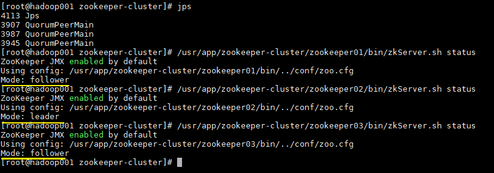

# ELK 實戰筆記

## ELK Stack 7.12 解壓安裝

### Elasticsearch 安裝

`cd /usr/local/`

`curl -L -O https://artifacts.elastic.co/downloads/elasticsearch/elasticsearch-7.12.0-linux-x86_64.tar.gz`

 `tar -xvf elasticsearch-7.12.0-linux-x86_64.tar.gz`

`rm elasticsearch-7.12.0-linux-x86_64.tar.gz`

`mv elasticsearch-7.12.0-linux-x86_64/elasticsearch`

`ln -s /usr/local/elasticsearch elasticsearch`

* 编辑 ./config/elasticsearch.yml

`vim /usr/local/elasticsearch-7.12.0/config/elasticsearch.yml`

```text
# 添加或修改
node.name: node-1
#network.host:0.0.0.0 代表開給外網連線
network.host: 0.0.0.0
http.port: 9200
cluster.initial_master_nodes: ["node-1"]
```

* 修改文件包含限制一个进程可以拥有的VMA\(虚拟内存区域\)的数量配置，编辑 /etc/sysctl.conf

`vim /etc/sysctl.conf`

```text
# 添加或修改
# sudo sysctl -p 使修改生效
vm.max_map_count = 262144
```

* 修改 ECS 安全组，放行 9200 端口

`ufw allow in 9200`

`ufw allow in 9300`

查看目前防火牆規則


```text
sudo ufw status # 查看目前防火牆規則
sudo ufw status numbered #以數字排列目前防火牆規則
```

*  創建帳戶

`adduser elasticsearch`

* 将对应的文件夹权限赋给该用户

`chown -R elasticsearch /usr/local/elasticsearch/`

* 切换至elasticsearch用户 

`su elasticsearch` 

* 进入启动目录启动 /usr/local/elasticsearch-7.12.0/bin 使用后台启动方式

`./elasticsearch -d`

* 測試是否成功啟動

 `curl -X GET "localhost:9200"`

創建 systemctl 服務

```text
#使用vim 編輯
/usr/lib/systemd/system/elasticsearch.service
#將以下內容貼上文件
[Unit]
Description=Elasticsearch
Documentation=http://www.elastic.co
Wants=network-online.target
After=network-online.target
[Service]
User=elasticsearch
Group=es
LimitNOFILE=100000
LimitNPROC=100000
ExecStart=/usr/local/elasticsearch-7.3.2/bin/elasticsearch
[Install]
WantedBy=multi-user.target
```

### Kibana 安裝

`cd /usr/local`

`curl -L -O https://artifacts.elastic.co/downloads/kibana/kibana-7.12.0-linux-x86_64.tar.gz`

`tar -xvf kibana-7.12.0-linux-x86_64.tar.gz`

`rm kibana-7.12.0-linux-x86_64.tar.gz`

`mv kibana-7.12.0-linux-x86_64/ kibana`

`ln -s /usr/local/kibana kibana`

* 設定檔設定

`vim config/kibana.yml`

```text
server.port: 5601
server.host: "123.456.789.0"
server.name: "kibana-test"
elasticsearch.hosts: ["http://10.10.0.8:9200"]
# kibana会将部分数据写入es，这个是ex中索引的名字
kibana.index: ".kibana"
```

*  創建帳戶

`adduser kibana`

* 将对应的文件夹权限赋给该用户

`chown -R kibana /usr/local/kibana`

* 切换至kibana用户 

`su kibana`

* 进入启动目录启动 /usr/local/kibana/bin 使用后台启动方式

`nohub ./kibana &`

* 測試是否成功啟動

 `http://localhost:5601`

### Logstash 安裝

* 安裝

`cd /usr/local`

`curl -L -O https://artifacts.elastic.co/downloads/logstash/logstash-7.12.0-linux-x86_64.tar.gz`

`tar -xvf logstash-7.12.0-linux-x86_64.tar.gz`

`rm logstash-7.12.0-linux-x86_64.tar.gz`

`mv logstash-7.12.0-linux-x86_64/ logstash`

~~ln -s /usr/local/logstash logstash~~


*  創建帳戶

`adduser logstash`

* 将对应的文件夹权限赋给该用户

`chown -R logstash /usr/local/logstash`

* 切换至logstash用户 

`su logstash`

```text
#編輯設定檔案
vim /usr/local/logstash.conf
```

```text
#內容請複製貼上
# Sample Logstash configuration for creating a simple
# Beats -> Logstash -> Elasticsearch pipeline.

input{

    kafka{

        bootstrap_servers => "10.140.0.10:9092,10.140.0.11:9092,10.140.0.12:9092"

        topics => ["nginx-logs"]

        codec => json

    }

}


output {

  elasticsearch {

        hosts => ["http://10.140.0.6:9200"]

        index => "nginx-logs"

       #index => "%{[@metadata][beat]}-%{[@metadata][version]}"

#       user => "elastic"

#       password => "P@ssw0rd@Data!"

  }

}


```

* 进入启动目录启动 /usr/local/logstash/bin 使用后台启动方式

`nohup bin/logstash -f config/logstash.conf &`

* 確認是否成功啟動

```text
[2021-04-19T01:17:55,954][INFO ][org.logstash.beats.Server][main][d30cec8718b4eec2fe086d75154440802a7f35a6572519d10
06ee383031ddb4c] Starting server on port: 5044
```

創建systemctl 服務

```text
#systemd管理kibana
/usr/lib/systemd/system/kibana.service
[Unit]
Description=Kinaba
Documentation=http://www.elastic.co
Wants=network-online.target
After=network-online.target
[Service]
User=kibana
Group=kibana
ExecStart=/usr/local/kibana/bin/kibana
[Install]
WantedBy=multi-user.target
```

### Filebeat 安裝

* 安裝

`cd /usr/local`

`curl -L -O https://artifacts.elastic.co/downloads/beats/filebeat/filebeat-7.12.0-linux-x86_64.tar.gz`

`tar -xvf filebeat-7.12.0-linux-x86_64.tar.gz`

`rm filebeat-7.12.0-linux-x86_64.tar.gz`

`mv filebeat-7.12.0-linux-x86_64/ filebeat`

`ln -s /usr/local/filebeat filebeat`

*  創建帳戶

`adduser filebeat`

* 将对应的文件夹权限赋给该用户

`chown -R filebeat /usr/local/filebeat`

* 切换至filebeat用户 

`su filebeat`

* Config 設定config

```text
vim /usr/local/filebeat/nginx.yml
```

內容:

```text
    #    include_lines: ['content']

    paths: /var/log/nginx/access.log

    tail_files: true

    fields:
           topicname: nginx-logs

    scan_frequency: 5s

    #開啟debug模式

    #logging.level: debug

    #logging.selectors: [publish]

    #logging.to_files: true

output.kafka:

  enabled: true

  hosts: ["10.140.0.10:9092","10.140.0.11:9092","10.140.0.12:9092"]

  topic: "nginx-logs"

  partition.hash:

  reachable_only: true

  compression: gzip

  max_message_bytes: 1000000

  required_acks: 1

  logging.to_files: true

```

* 进入启动目录启动 /usr/local/logstash/bin 使用后台启动方式注意後面可以帶入不同設定檔檔名

`nohup ./filebeat -e -c nginx.yml &`

* 測試是否成功啟動

`ps -aux | grep filebeat`


## 啟動命令

### ELK

```text
#filebeat
nohup ./filebeat -e -c nginx.yml &
#logstash
nohup bin/logstash -f config/logstash.conf &
#Elasticsearch-head
nohup grunt server &
#CMAK
nohup bin/cmak -Dconfig.file=conf/application.conf -Dhttp.port=9001 &
#Elasticsearch 
./bin/elasticsearch -d
#kibana
nohup ./bin/kibana &
```

#### 重啟程序

```text
kill -9 $(ps aux | grep elasticsearch | awk '{print $2}')
```

### Zookeeper&Kafka

```text
#Zookeeper
启动节点
/usr/local/zookeeper/bin/zkServer.sh start

#查詢啟動是否成功
/usr/local/zookeeper/bin/zkServer.sh status

#kafka
nohup bin/kafka-server-start.sh config/server-1.properties &
```

### Seige

```text
siege  http://10.170.0.11/ -c600 -t600s -b
siege  http://10.170.0.2/ -c600 -t600s -b
```

## Kafka — 基于 ZooKeeper 搭建 Kafka 

## Zookeeper集群搭建

Zookeeper 依靠java運行需先安裝Openjava-11jdk 套件

为保证集群高可用，Zookeeper 集群的节点数最好是奇数，最少有三个节点，所以这里搭建一个三个节点的集群。

#### 下载 & 解压

下载对应版本 Zookeeper，这里我下载的版本 `3.6.3`。官方下载地址：[archive.apache.org/dist/zookee…](https://archive.apache.org/dist/zookeeper/)

```text
# 下载
wget https://downloads.apache.org/zookeeper/zookeeper-3.6.3/apache-zookeeper-3.6.3-bin.tar.gz
# 解压
tar -zxvf apache-zookeeper-3.6.3-bin.tar.gz
复制代码
```

#### 修改配置

拷贝三份 zookeeper 安装包。分别进入安装目录的 `conf` 目录，拷贝配置样本 `zoo_sample.cfg` 为 `zoo.cfg` 并进行修改，修改后三份配置文件内容分别如下：

zookeeper01 配置：

```text
tickTime=2000
initLimit=10
syncLimit=5
dataDir=/usr/local/zookeeper/data/01
dataLogDir=/usr/local/zookeeper/log/01
clientPort=2181

# server.1 这个1是服务器的标识，可以是任意有效数字，标识这是第几个服务器节点，这个标识要写到dataDir目录下面myid文件里
# 指名集群间通讯端口和选举端口
server.1=127.0.0.1:2287:3387
server.2=127.0.0.1:2288:3388
server.3=127.0.0.1:2289:3389
复制代码
```

> 如果是多台服务器，则集群中每个节点通讯端口和选举端口可相同，IP 地址修改为每个节点所在主机 IP 即可。

zookeeper02 配置，与 zookeeper01 相比，只有 `dataLogDir`、`dataLogDir` 和 `clientPort` 不同：

```text
tickTime=2000
initLimit=10
syncLimit=5
dataDir=/usr/local/zookeeper/data/02
dataLogDir=/usr/local/zookeeper/log/02
clientPort=2182
server.1=127.0.0.1:2287:3387
server.2=127.0.0.1:2288:3388
server.3=127.0.0.1:2289:3389
复制代码
```

zookeeper03 配置，与 zookeeper01，02 相比，也只有 `dataLogDir`、`dataLogDir` 和 `clientPort` 不同：

```text
tickTime=2000
initLimit=10
syncLimit=5
dataDir=/usr/local/zookeeper/data/03
dataLogDir=/usr/local/zookeeper/log/03
clientPort=2183
server.1=127.0.0.1:2287:3387
server.2=127.0.0.1:2288:3388
server.3=127.0.0.1:2289:3389
复制代码
```

> 配置参数说明：
>
> * **tickTime**：用于计算的基础时间单元。比如 session 超时：N\*tickTime；
> * **initLimit**：用于集群，允许从节点连接并同步到 master 节点的初始化连接时间，以 tickTime 的倍数来表示；
> * **syncLimit**：用于集群， master 主节点与从节点之间发送消息，请求和应答时间长度（心跳机制）；
> * **dataDir**：数据存储位置；
> * **dataLogDir**：日志目录；
> * **clientPort**：用于客户端连接的端口，默认 2181

#### 标识节点

分别在三个节点的数据存储目录下新建 `myid` 文件,并写入对应的节点标识。Zookeeper 集群通过 `myid` 文件识别集群节点，并通过上文配置的节点通信端口和选举端口来进行节点通信，选举出 leader 节点。

创建存储目录：

```text
# dataDir
mkdir -vp  /usr/local/zookeeper/data/01
# dataDir
mkdir -vp  /usr/local/zookeeper/data/02
# dataDir
mkdir -vp  /usr/local/zookeeper/data/03
复制代码
```

创建并写入节点标识到 `myid` 文件：

```text
#server1
echo "1" > /usr/local/zookeeper/data/01/myid
#server2
echo "2" > /usr/local/zookeeper/data/02/myid
#server3
echo "3" > /usr/local/zookeeper/data/03/myid
复制代码
```

### 启动Zookeeper集群

分别启动三个节点：

```text
# 启动节点1
/usr/local/zookeeper/bin/zkServer.sh start
# 启动节点2
/usr/local/zookeeper/bin/zkServer.sh start
# 启动节点3
/usr/local/zookeeper/bin/zkServer.sh start
复制代码
```

#### 集群验证

使用 jps 查看进程，并且使用 `zkServer.sh status` 查看集群各个节点状态。如图三个节点进程均启动成功，并且两个节点为 follower 节点，一个节点为 leader 节点。

```text
/usr/local/zookeeper/bin/zkServer.sh status
```




#### 設定 systemd 的 守護進程 <a id="&#x8A2D;&#x5B9A;-systemd-&#x7684;-&#x5B88;&#x8B77;&#x9032;&#x7A0B;"></a>

 `$ vi /etc/systemd/system/zookeeper.service`

```text
[Unit]
Description=zookeeper
After=syslog.target network.target

[Service]
Type=simple
User=kafka
Group=kafka
ExecStart=/usr/local/zookeeper/bin/zookeeper-server-start.sh /usr/local/zookeeper/config/server-1.properties
ExecStop=/usr/local/zookeeper/bin/zookeeper-server-stop.sh

[Install]
WantedBy=multi-user.target
```

|  |  |
| :--- | :--- |


## Kafka集群搭建

#### 下载解压

Kafka 安装包官方下载地址：[kafka.apache.org/downloads](http://kafka.apache.org/downloads) ，本用例下载的版本为 `2.8.0`，下载命令：

```text
# 下载
wget https://www-eu.apache.org/dist/kafka/2.8.0/kafka_2.12-2.8.0.tgz
# 解压
tar -xzf kafka_2.12-2.8.0.tgz
复制代码
```

> 这里 j 解释一下 kafka 安装包的命名规则：以 `kafka_2.12-2.2.0.tgz` 为例，前面的 2.12 代表 Scala 的版本号（Kafka 采用 Scala 语言进行开发），后面的 2.2.0 则代表 Kafka 的版本号。

#### 拷贝配置文件

进入解压目录的 `config` 目录下 ，拷贝三份配置文件：

```text
# cp server.properties server-1.properties
# cp server.properties server-2.properties
# cp server.properties server-3.properties
复制代码
```

####  修改配置

分别修改三份配置文件中的部分配置，如下：

server-1.properties：

```text
# The id of the broker. 集群中每个节点的唯一标识
broker.id=1
# 监听地址
listeners=PLAINTEXT://10.140.0.10:9092
# 数据的存储位置
log.dirs=/usr/local/kafka-logs/00
# Zookeeper连接地址
zookeeper.connect=10.140.0.10:2181,10.140.0.11:2181,10.140.0.12:2181
复制代码
```

server-2.properties：

```text
broker.id=2
listeners=PLAINTEXT://10.140.0.11:9092
log.dirs=/usr/local/kafka-logs/01
zookeeper.connect=10.140.0.10:2181,10.140.0.11:2181,10.140.0.12:2181
复制代码
```

server-3.properties：

```text
broker.id=3
listeners=PLAINTEXT://10.140.0.12:9092
log.dirs=/usr/local/kafka-logs/02
zookeeper.connect=10.140.0.10:2181,10.140.0.11:2181,10.140.0.12:2181
复制代码
```

这里需要说明的是 `log.dirs` 指的是数据日志的存储位置，确切的说，就是分区数据的存储位置，而不是程序运行日志的位置。程序运行日志的位置是通过同一目录下的 `log4j.properties` 进行配置的。

### 启动Kafka集群

分别指定不同配置文件，启动三个 Kafka 节点。启动后可以使用 jps 查看进程，此时应该有三个 zookeeper 进程和三个 kafka 进程。

```text
bin/kafka-server-start.sh config/server-1.properties &
bin/kafka-server-start.sh config/server-2.properties &
bin/kafka-server-start.sh config/server-3.properties &
复制代码
```

#### 创建测试主题

创建测试主题：

```text
bin/kafka-topics.sh --create --bootstrap-server 10.140.0.10:9092 \
					--replication-factor 3 \
					--partitions 1 --topic my-replicated-topic
复制代码
```

创建后可以使用以下命令查看创建的主题信息：

```text
bin/kafka-topics.sh --describe --bootstrap-server 10.140.0.10:9092 --topic my-replicated-topic
复制代码
```


可以看到分区 0 的有 0,1,2 三个副本，且三个副本都是可用副本，都在 ISR\(in-sync Replica 同步副本\) 列表中，其中 1 为首领副本，此时代表集群已经搭建成功。

 `vi /etc/systemd/system/kafka.service`

```text
[Unit]
Description=Apache Kafka
Requires=zookeeper.service
After=zookeeper.service

[Service]
Type=simple
User=kafka
Group=kafkaa
ExecStart=/opt/kafka/bin/kafka-server-start.sh /opt/kafka/config/server.properties
ExecStop=/opt/kafka/bin/kafka-server-stop.sh

[Install]
WantedBy=multi-user.target
```

### Kafka 相關設定檔案

### 設定檔詳解

#### 1. 生產端的配置檔案 producer.properties

```text
#指定kafka節點列表，用於獲取metadata，不必全部指定
#需要kafka的伺服器地址，來獲取每一個topic的分片數等元資料資訊。
metadata.broker.list=kafka01:9092,kafka02:9092,kafka03:9092

#生產者生產的訊息被髮送到哪個block，需要一個分組策略。
#指定分割槽處理類。預設kafka.producer.DefaultPartitioner，表通過key雜湊到對應分割槽
#partitioner.class=kafka.producer.DefaultPartitioner

#生產者生產的訊息可以通過一定的壓縮策略（或者說壓縮演算法）來壓縮。訊息被壓縮後傳送到broker叢集，
#而broker叢集是不會進行解壓縮的，broker叢集只會把訊息傳送到消費者叢集，然後由消費者來解壓縮。
#是否壓縮，預設0表示不壓縮，1表示用gzip壓縮，2表示用snappy壓縮。
#壓縮後訊息中會有頭來指明訊息壓縮型別，故在消費者端訊息解壓是透明的無需指定。
#文字資料會以1比10或者更高的壓縮比進行壓縮。
compression.codec=none

#指定序列化處理類，訊息在網路上傳輸就需要序列化，它有String、陣列等許多種實現。
serializer.class=kafka.serializer.DefaultEncoder

#如果要壓縮訊息，這裡指定哪些topic要壓縮訊息，預設empty，表示不壓縮。
#如果上面啟用了壓縮，那麼這裡就需要設定
#compressed.topics= 
#這是訊息的確認機制，預設值是0。在面試中常被問到。
#producer有個ack引數，有三個值，分別代表：
#（1）不在乎是否寫入成功；
#（2）寫入leader成功；
#（3）寫入leader和所有副本都成功；
#要求非常可靠的話可以犧牲效能設定成最後一種。
#為了保證訊息不丟失，至少要設定為1，也就
#是說至少保證leader將訊息儲存成功。
#設定傳送資料是否需要服務端的反饋,有三個值0,1,-1，分別代表3種狀態：
#0: producer不會等待broker傳送ack。生產者只要把訊息傳送給broker之後，就認為傳送成功了，這是第1種情況；
#1: 當leader接收到訊息之後傳送ack。生產者把訊息傳送到broker之後，並且訊息被寫入到本地檔案，才認為傳送成功，這是第二種情況；#-1: 當所有的follower都同步訊息成功後傳送ack。不僅是主的分割槽將訊息儲存成功了，
#而且其所有的分割槽的副本數也都同步好了，才會被認為發動成功，這是第3種情況。
request.required.acks=0

#broker必須在該時間範圍之內給出反饋，否則失敗。
#在向producer傳送ack之前,broker允許等待的最大時間 ，如果超時,
#broker將會向producer傳送一個error ACK.意味著上一次訊息因為某種原因
#未能成功(比如follower未能同步成功)
request.timeout.ms=10000

#生產者將訊息傳送到broker，有兩種方式，一種是同步，表示生產者傳送一條，broker就接收一條；
#還有一種是非同步，表示生產者積累到一批的訊息，裝到一個池子裡面快取起來，再發送給broker，
#這個池子不會無限快取訊息，在下面，它分別有一個時間限制（時間閾值）和一個數量限制（數量閾值）的引數供我們來設定。
#一般我們會選擇非同步。
#同步還是非同步傳送訊息，預設“sync”表同步，"async"表非同步。非同步可以提高發送吞吐量,
#也意味著訊息將會在本地buffer中,並適時批量傳送，但是也可能導致丟失未傳送過去的訊息
producer.type=sync

#在async模式下,當message被快取的時間超過此值後,將會批量傳送給broker,
#預設為5000ms
#此值和batch.num.messages協同工作.
queue.buffering.max.ms = 5000

#非同步情況下，快取中允許存放訊息數量的大小。
#在async模式下,producer端允許buffer的最大訊息量
#無論如何,producer都無法儘快的將訊息傳送給broker,從而導致訊息在producer端大量沉積
#此時,如果訊息的條數達到閥值,將會導致producer端阻塞或者訊息被拋棄，預設為10000條訊息。
queue.buffering.max.messages=20000

#如果是非同步，指定每次批量傳送資料量，預設為200
batch.num.messages=500

#在生產端的緩衝池中，訊息傳送出去之後，在沒有收到確認之前，該緩衝池中的訊息是不能被刪除的，
#但是生產者一直在生產訊息，這個時候緩衝池可能會被撐爆，所以這就需要有一個處理的策略。
#有兩種處理方式，一種是讓生產者先別生產那麼快，阻塞一下，等會再生產；另一種是將緩衝池中的訊息清空。
#當訊息在producer端沉積的條數達到"queue.buffering.max.meesages"後阻塞一定時間後,
#佇列仍然沒有enqueue(producer仍然沒有傳送出任何訊息)
#此時producer可以繼續阻塞或者將訊息拋棄,此timeout值用於控制"阻塞"的時間
#-1: 不限制阻塞超時時間，讓produce一直阻塞,這個時候訊息就不會被拋棄
#0: 立即清空佇列,訊息被拋棄
queue.enqueue.timeout.ms=-1


#當producer接收到error ACK,或者沒有接收到ACK時,允許訊息重發的次數
#因為broker並沒有完整的機制來避免訊息重複,所以當網路異常時(比如ACK丟失)
#有可能導致broker接收到重複的訊息,預設值為3.
message.send.max.retries=3

#producer重新整理topic metada的時間間隔,producer需要知道partition leader
#的位置,以及當前topic的情況
#因此producer需要一個機制來獲取最新的metadata,當producer遇到特定錯誤時,
#將會立即重新整理
#(比如topic失效,partition丟失,leader失效等),此外也可以通過此引數來配置
#額外的重新整理機制，預設值600000
topic.metadata.refresh.interval.ms=60000
```

#### 2. 消費端的配置檔案 consumer.properties:

```text
#消費者叢集通過連線Zookeeper來找到broker。
#zookeeper連線伺服器地址
zookeeper.connect=zk01:2181,zk02:2181,zk03:2181

#zookeeper的session過期時間，預設5000ms，用於檢測消費者是否掛掉
zookeeper.session.timeout.ms=5000

#當消費者掛掉，其他消費者要等該指定時間才能檢查到並且觸發重新負載均衡
zookeeper.connection.timeout.ms=10000

#這是一個時間閾值。
#指定多久消費者更新offset到zookeeper中。
#注意offset更新時基於time而不是每次獲得的訊息。
#一旦在更新zookeeper發生異常並重啟，將可能拿到已拿到過的訊息
zookeeper.sync.time.ms=2000

#指定消費
group.id=xxxxx

#這是一個數量閾值，經測試是500條。
#當consumer消費一定量的訊息之後,將會自動向zookeeper提交offset資訊#注意offset資訊並不是每消費一次訊息就向zk提交
#一次,而是現在本地儲存(記憶體),並定期提交,預設為true
auto.commit.enable=true

# 自動更新時間。預設60 * 1000
auto.commit.interval.ms=1000

# 當前consumer的標識,可以設定,也可以有系統生成,
#主要用來跟蹤訊息消費情況,便於觀察
conusmer.id=xxx

# 消費者客戶端編號，用於區分不同客戶端，預設客戶端程式自動產生
client.id=xxxx

# 最大取多少塊快取到消費者(預設10)
queued.max.message.chunks=50

# 當有新的consumer加入到group時,將會reblance,此後將會
#有partitions的消費端遷移到新  的consumer上,如果一個
#consumer獲得了某個partition的消費許可權,那麼它將會向zk
#註冊 "Partition Owner registry"節點資訊,但是有可能
#此時舊的consumer尚沒有釋放此節點, 此值用於控制,
#註冊節點的重試次數.
rebalance.max.retries=5

#每拉取一批訊息的最大位元組數
#獲取訊息的最大尺寸,broker不會像consumer輸出大於
#此值的訊息chunk 每次feth將得到多條訊息,此值為總大小,
#提升此值,將會消耗更多的consumer端記憶體
fetch.min.bytes=6553600

#當訊息的尺寸不足時,server阻塞的時間,如果超時,
#訊息將立即傳送給consumer
#資料一批一批到達，如果每一批是10條訊息，如果某一批還
#不到10條，但是超時了，也會立即傳送給consumer。
fetch.wait.max.ms=5000
socket.receive.buffer.bytes=655360

# 如果zookeeper沒有offset值或offset值超出範圍。
#那麼就給個初始的offset。有smallest、largest、
#anything可選，分別表示給當前最小的offset、
#當前最大的offset、拋異常。預設largest
auto.offset.reset=smallest

# 指定序列化處理類
derializer.class=kafka.serializer.DefaultDecoder
```

#### 3.服務端的配置檔案 server.properties

```text
#broker的全域性唯一編號，不能重複
broker.id=0

#用來監聽連結的埠，producer或consumer將在此埠建立連線
port=9092

#處理網路請求的執行緒數量，也就是接收訊息的執行緒數。
#接收執行緒會將接收到的訊息放到記憶體中，然後再從記憶體中寫入磁碟。
num.network.threads=3

#訊息從記憶體中寫入磁碟是時候使用的執行緒數量。
#用來處理磁碟IO的執行緒數量
num.io.threads=8

#傳送套接字的緩衝區大小
socket.send.buffer.bytes=102400

#接受套接字的緩衝區大小
socket.receive.buffer.bytes=102400

#請求套接字的緩衝區大小
socket.request.max.bytes=104857600

#kafka執行日誌存放的路徑
log.dirs=/export/servers/logs/kafka

#topic在當前broker上的分片個數
num.partitions=2

#我們知道segment檔案預設會被保留7天的時間，超時的話就
#會被清理，那麼清理這件事情就需要有一些執行緒來做。這裡就是
#用來設定恢復和清理data下資料的執行緒數量
num.recovery.threads.per.data.dir=1

#segment檔案保留的最長時間，預設保留7天（168小時），
#超時將被刪除，也就是說7天之前的資料將被清理掉。
log.retention.hours=168

#滾動生成新的segment檔案的最大時間
log.roll.hours=168

#日誌檔案中每個segment的大小，預設為1G
log.segment.bytes=1073741824

#上面的引數設定了每一個segment檔案的大小是1G，那麼
#就需要有一個東西去定期檢查segment檔案有沒有達到1G，
#多長時間去檢查一次，就需要設定一個週期性檢查檔案大小
#的時間（單位是毫秒）。
log.retention.check.interval.ms=300000

#日誌清理是否開啟
log.cleaner.enable=true

#broker需要使用zookeeper儲存meta資料
zookeeper.connect=zk01:2181,zk02:2181,zk03:2181

#zookeeper連結超時時間
zookeeper.connection.timeout.ms=6000

#上面我們說過接收執行緒會將接收到的訊息放到記憶體中，然後再從記憶體
#寫到磁碟上，那麼什麼時候將訊息從記憶體中寫入磁碟，就有一個
#時間限制（時間閾值）和一個數量限制（數量閾值），這裡設定的是
#數量閾值，下一個引數設定的則是時間閾值。
#partion buffer中，訊息的條數達到閾值，將觸發flush到磁碟。
log.flush.interval.messages=10000

#訊息buffer的時間，達到閾值，將觸發將訊息從記憶體flush到磁碟，
#單位是毫秒。
log.flush.interval.ms=3000

#刪除topic需要server.properties中設定delete.topic.enable=true否則只是標記刪除
delete.topic.enable=true

#此處的host.name為本機IP(重要),如果不改,則客戶端會丟擲:
#Producer connection to localhost:9092 unsuccessful 錯誤!
host.name=kafka01

advertised.host.name=192.168.239.128
```

### Kafka 命令相關

### Kafka 集群狀態查詢方式


zookeeper 是 kafka 的分散式協調系統，在 kafka 上多個節點間需要協調的內容，例如：彼此節點的ID，位置與當前狀態，或是跨節點 topic 的設定與狀態。取名叫做 zookeeper 就是在協調混亂的分散式系統，,裡面各種不同種類的服務都要協調，象個動物園管  
理員。[Zookeeper 的官方文件](https://zookeeper.apache.org/doc/r3.3.3/zookeeperAdmin.html) 有更詳細的說明。

Kafka 的節點資訊，與當前狀態，是放在 zookeeper 上，我們可以透過以下指令取得

```text
# 首先先取得 zkCli 的 cli，這個只有連進任何一台 zookeeper 內部都有
kubectl exec -it kafka-0-zookeeper-0 --container kafka-broker bash

# 由於是在 Pod 內部，直接 localhost 詢問本地
/usr/bin/zkCli.sh -server localhost:2181

```

取得 kafka broker 資料

```text
# List root Nodes
$ ls /

[cluster, controller, controller_epoch, brokers, zookeeper, admin, isr_change_notification, consumers, log_dir_event_notification, latest_producer_id_block, config]

# Brokers 的資料節點
$ ls /brokers
[ids, topics, seqid]

# List /brokers/ids 得到三個 kafka broker
$ ls /brokers/ids
[0, 1, 2]

# 列出所有 topic 名稱
ls /brokers/topics
[ticker]
```

ticker 是上篇範利用到的 topic

簡單來說，zookeeper 存放這些狀態與 topic 的 metadata

* 儲存核心的狀態與資料，特別是 broker 萬一掛掉，也還需要維持的資料
* 協調工作，例如協助 broker 處理 quorum，紀錄 partition master 等

```text
# 離開 zkCli
quit                  
```

### Kafka Topic

### 查看

以下命令中使用的zookeeper配置地址为127.0.0.1:2181，bootstrap--server\(即broker\)地址为: 127.0.0.1:9292

1，查看kafka topic列表，使用--list参数

```text
bin/kafka-topics.sh --zookeeper 127.0.0.1:2181 --list
__consumer_offsets
lx_test_topic
test
```

2，查看kafka特定topic的详情，使用--topic与--describe参数

```text
bin/kafka-topics.sh --zookeeper 127.0.0.1:2181 --topic lx_test_topic --describe
Topic:lx_test_topic     PartitionCount:1        ReplicationFactor:1     Configs:
        Topic: lx_test_topic    Partition: 0    Leader: 0       Replicas: 0     Isr: 0
```

列出了lx\_test\_topic的parition数量、replica因子以及每个partition的leader、replica信息

### 創建

創建Topic

```text
[root@shtest01 ~]# bin/kafka-topics.sh --create --bootstrap-server 10.140.0.10:9092 --replication-factor 30 --partitions 3 --topic nginx-logs

```

### 修改Topic 分片、副本數量

一 .修改Kafka Topic副本数

```text
##新建测试topic test01
1.bin/kafka-topics.sh --zookeeper 10.140.0.10:2181 --create --partitions 3 --replication-factor 3 --topic test01   

##查看Topic详情如下:
2.bin/kafka-topics.sh --zookeeper 10.140.0.10:2181 --topic test01 --describe
  Topic:test01	PartitionCount:5	ReplicationFactor:3	Configs:
	Topic: test01	Partition: 0	Leader: 0	Replicas: 0,1,2	Isr: 0,1,2
	Topic: test01	Partition: 1	Leader: 1	Replicas: 1,2,0	Isr: 1,2,0
	Topic: test01	Partition: 2	Leader: 2	Replicas: 2,0,1	Isr: 2,0,1
	Topic: test01	Partition: 3	Leader: 0	Replicas: 0,2,1	Isr: 0,2,1
	Topic: test01	Partition: 4	Leader: 1	Replicas: 1,0,2	Isr: 1,0,2
 
 ##創建increase-replication-factor.json 並匯內文
3.cat << EOF > increase-replication-factor.json
{"version":1,
"partitions":[
{"topic":"test01","partition":0,"replicas":[0,2]},
{"topic":"test01","partition":1,"replicas":[0,1]},
{"topic":"test01","partition":2,"replicas":[1,2]},
{"topic":"test01","partition":3,"replicas":[1,2]},
{"topic":"test01","partition":4,"replicas":[0,2]}
]
}
EOF

##新建修改副本数 increase-replication-factor.json 文件
4.bin/kafka-reassign-partitions.sh --zookeeper 172.18.163.203:2181,172.18.163.204:2181,172.18.163.205:2181  --reassignment-json-file increase-replication-factor.json --execute
##执行操作命令将副本数改为 2 

5.看到successfully,查看现在test01的副本数已经修改为2
  Topic:test01	PartitionCount:5	ReplicationFactor:2	Configs:
	Topic: test01	Partition: 0	Leader: 0	Replicas: 0,2	Isr: 0,2
	Topic: test01	Partition: 1	Leader: 1	Replicas: 0,1	Isr: 1,0
	Topic: test01	Partition: 2	Leader: 2	Replicas: 1,2	Isr: 2,1
	Topic: test01	Partition: 3	Leader: 1	Replicas: 1,2	Isr: 2,1
	Topic: test01	Partition: 4	Leader: 0	Replicas: 0,2	Isr: 0,2
————————————————
版权声明：本文为CSDN博主「DreamWeaver_Zhou」的原创文章，遵循CC 4.0 BY-SA版权协议，转载请附上原文出处链接及本声明。
原文链接：https://blog.csdn.net/DreamWeaver_zhou/article/details/103260391
```

二 . 修改Kafka 分区数操作步骤

```text
1.bin/kafka-topics.sh --zookeeper 172.18.163.203:2181,172.18.163.204:2181,172.18.163.205:2181 --create --partitions 5 --replication-factor 3 --topic test01   
##新建测试topic test01
2.bin/kafka-topics.sh --zookeeper 172.18.163.203:2181 --topic test01 --describe ##查看Topic详情如下:
   Topic:test01    PartitionCount:5    ReplicationFactor:2    Configs:
    Topic: test01    Partition: 0    Leader: 0    Replicas: 0,2    Isr: 0,2
    Topic: test01    Partition: 1    Leader: 1    Replicas: 0,1    Isr: 1,0
    Topic: test01    Partition: 2    Leader: 2    Replicas: 1,2    Isr: 2,1
    Topic: test01    Partition: 3    Leader: 1    Replicas: 1,2    Isr: 2,1
    Topic: test01    Partition: 4    Leader: 0    Replicas: 0,2    Isr: 0,2
##分区数为5,副本数为2

3.bin/kafka-topics.sh --zookeeper 172.18.163.203:2181,172.18.163.204:2181,172.18.163.205:2181 -alter --partitions 6 --topic test01  ##分区数只能增加不能减小

4.bin/kafka-topics.sh --zookeeper 172.18.163.203:2181 --topic test01 --describe
Topic:test01    PartitionCount:6    ReplicationFactor:2    Configs:
    Topic: test01    Partition: 0    Leader: 0    Replicas: 0,2    Isr: 0,2
    Topic: test01    Partition: 1    Leader: 1    Replicas: 0,1    Isr: 1,0
    Topic: test01    Partition: 2    Leader: 2    Replicas: 1,2    Isr: 2,1
    Topic: test01    Partition: 3    Leader: 1    Replicas: 1,2    Isr: 2,1
    Topic: test01    Partition: 4    Leader: 0    Replicas: 0,2    Isr: 0,2
    Topic: test01    Partition: 5    Leader: 2    Replicas: 2,0    Isr: 2,0
##查看详情来看分区数已经被改成6个,副本数还是2
```

———————————————— 版权声明：本文为CSDN博主

### 


### 刪除topic

刪除kafka topic及其資料，嚴格來說並不是很難的操作。但是，往往給kafka 使用者帶來諸多問題。專案組之前接觸過多個開發者，發現都會偶然出現無法徹底刪除kafka的情況。本文總結多個刪除kafka topic的應用場景，總結一套刪除kafka topic的標準操作方法。

**step1：**

如果需要被刪除topic 此時正在被程式 produce和consume，則這些生產和消費程式需要停止。

因為如果有程式正在生產或者消費該topic，則該topic的offset資訊一致會在broker更新。呼叫kafka delete命令則無法刪除該topic。

同時，需要設定 auto.create.topics.enable = false，預設設定為true。如果設定為true，則produce或者fetch 不存在的topic也會自動建立這個topic。這樣會給刪除topic帶來很多意向不到的問題。

所以，這一步很重要，必須設定auto.create.topics.enable = false，並認真把生產和消費程式徹底全部停止。

**step2：**

server.properties 設定 delete.topic.enable=true

如果沒有設定 delete.topic.enable=true，則呼叫kafka 的delete命令無法真正將topic刪除，而是顯示（marked for deletion）

**step3：**

呼叫命令刪除topic：

```text
./bin/kafka-topics --delete --zookeeper 【zookeeper server:port】 --topic 【topic name】
```

**step4：**

刪除kafka儲存目錄（server.properties檔案log.dirs配置，預設為"/data/kafka-logs"）相關topic的資料目錄。

注意：如果kafka 有多個 broker，且每個broker 配置了多個數據盤（比如 /data/kafka-logs,/data1/kafka-logs …），且topic也有多個分割槽和replica，則需要對所有broker的所有資料盤進行掃描，刪除該topic的所有分割槽資料。

**一般而言，經過上面4步就可以正常刪除掉topic和topic的資料。但是，如果經過上面四步，還是無法正常刪除topic，則需要對kafka在zookeeer的儲存資訊進行刪除。具體操作如下：**

（注意：以下步驟裡面，kafka在zk裡面的節點資訊是採用預設值，如果你的系統修改過kafka在zk裡面的節點資訊，則需要根據系統的實際情況找到準確位置進行操作）

**step5：**

找一臺部署了zk的伺服器，使用命令：

bin/zkCli.sh -server 【zookeeper server:port】

登入到zk shell，然後找到topic所在的目錄：ls /brokers/topics，找到要刪除的topic，然後執行命令：

rmr /brokers/topics/【topic name】

即可，此時topic被徹底刪除。

如果topic 是被標記為 marked for deletion，則通過命令 ls /admin/delete\_topics，找到要刪除的topic，然後執行命令：

rmr /admin/delete\_topics/【topic name】

**備註：**

網路上很多其它文章還說明，需要刪除topic在zk上面的消費節點記錄、配置節點記錄，比如：

rmr /consumers/【consumer-group】

rmr /config/topics/【topic name】

其實正常情況是不需要進行這兩個操作的，如果需要，那都是由於操作不當導致的。比如step1停止生產和消費程式沒有做，step2沒有正確配置。也就是說，正常情況下嚴格按照step1 – step5 的步驟，是一定能夠正常刪除topic的。

**step6：**

完成之後，呼叫命令：

./bin/kafka-topics.sh --list --zookeeper 【zookeeper server:port】

檢視現在kafka的topic資訊。正常情況下刪除的topic就不會再顯示。

但是，如果還能夠查詢到刪除的topic，則重啟zk和kafka即可。

### Kafka Consumer

3，查看consumer group列表，使用--list参数

查看consumer group列表有新、旧两种命令，分别查看新版\(信息保存在broker中\)consumer列表和老版\(信息保存在zookeeper中\)consumer列表，因而需要区分指定bootstrap--server和zookeeper参数：

```text
bin/kafka-consumer-groups.sh --new-consumer --bootstrap-server 127.0.0.1:9292 --list
lx_test
```

```text
bin/kafka-consumer-groups.sh --zookeeper 127.0.0.1:2181 --list
console-consumer-86845
console-consumer-11967

```

4，查看特定consumer group 详情，使用--group与--describe参数

同样根据新/旧版本的consumer，分别指定bootstrap-server与zookeeper参数:

```text
bin/kafka-consumer-groups.sh --new-consumer --bootstrap-server 127.0.0.1:9292 --group lx_test --describe
GROUP                          TOPIC                          PARTITION  CURRENT-OFFSET  LOG-END-OFFSET  LAG             OWNER
lx_test                        lx_test_topic             0          465             465             0               kafka-python-1.3.1_/127.0.0.1
```

```text
bin/kafka-consumer-groups.sh --zookeeper 127.0.0.1:2181 --group console-consumer-11967 --
```

### Kafka 坑!!

1. filebeat Topic進入kafka 後只有 1個partition 1ReplicationFactor

kafka自动创建主题时指定分区数

可以通过修改kafka broker的server.properties配置文件的auto.create.topics.enable来开启主题自动创建功能，如果相关闭主题自动创建功能，设置auto.create.topics.enable=false即可，自动创建主题默认创建一个分区，为了提高kafka吞吐量，我们可以根据实际需要通过修改num.partitions这个配置来调整默认创建主题的分区数

num.partitions=50 就意味着默认为每个自动创建主题创建50个分区 

```text
############################ Topic setting ###########################################

auto.create.topics.enable = true
num.partitions=3
default.replication.factor=3
```

[https://blog.csdn.net/john1337/article/details/106914959](https://blog.csdn.net/john1337/article/details/106914959)

## Elasticsearch

### 叢集狀態查詢

```text
curl -XGET 'http://localhost:9200/_cluster/health?pretty'
```

### 

Elasticsearch Index

### 創建Index

```text
curl -XPUT "http://localhost:9200/nginx-logs" -H 'Content-Type: application/json' -d'{  "settings": {    "number_of_shards": 30,    "number_of_replicas": 1  },  "mappings": {    "properties": {      "field1": { "type": "text" }    }  }}'
```

## logstash

### logstash Yml 檔


### logstash  conf 檔


### logstash 坑!!

#### 1.kafka Topic 消費產生過多lag

####  大早上的收到郵件告警，提示a日誌的ods層數量與dwd層的對不上，想到了上一次也是這樣，不過上一次治標不治本，只是把kafka的group\_id換了，能保證一小段時間的正常，當時也只知道這是消費延遲造成的，因爲通過查詢發現，本來4號的日誌4號就應該寫到hdfs完成的，結果5號，6號還在往裏面寫，這次就準備好好的排查一下

通過kafka-monitor的監控，發現a日誌的topic\_id的28個分區的Lag都很大，延遲比較嚴重，達到了9千多萬，首先是考慮到服務器性能問題，因爲該日誌消費是在一臺負載比較高的服務器上，所以先把它遷移到負載和cpu比較ok的服務器，啓動以後觀察一小時，發現Lag還是在不斷的增加，說明消費速度還是趕不上生產的速度，說明單單遷移一下服務器是解決不了問題的。

查看了一下logstash官網發現kafka作爲input時，有一個關於消費線程數量的配置是很重要的，並且官方建議配置的數量最好與topic\_id的分區數量相等，即 consumer\_threads =&gt; 28，但是配置完了以後監控kafka發現，消費速度還是趕不上生產速度，這個時候就不得不考慮是logstash自身的一個瓶頸了

通過查詢logstash性能優化發現，還有一個參數也是至關重要的，就是每個logstash進程佔用的最大內存，於是修改了一下logstash安裝目錄下的bin目錄下的 logstash.lib.sh 文件，


這時候發現Lag慢慢在下降了，但是過一段時間又升起來了，通過觀察Last seen發現有的分區一小時前就沒消費了，但是延遲很大，雖然一個線程對應一個分區，但是如果資源不足，可能線程就要等待了，所以一直不消費，這時候慢慢調整consumer\_threads 的數量到最優，最後調到了  consumer\_threads =&gt; 7，發現再也不存在延遲消費的情況了

所以这里也涉及到一个kafka的消费机制,一个topic的partition最多被一个线程消费,logstash配置的线程数也不宜过多,但是所有节点的总线程数必须要比topic下的partition小或者等于才行,这样资源才会合理利用...

#### consumer\_threads 配置要領

####  1.消費者CPU線程總數/主題分區數&gt;取得值平均分配到logstash


#### consumer\_threads  設定方式

```text
input {
  kafka {
    bootstrap_servers => "10.146.0.3:9092,10.146.0.5:9092,10.140.0.6:9092"
    topics => ["nginx-logs"]
    consumer_threads => 2
    group_id => "logstash"
    codec => "json"
    decorate_events => true
  }
}
```

## 設定檔備份

### Zookeeper 設定檔

```text
# The number of milliseconds of each tick
tickTime=2000
# The number of ticks that the initial
# synchronization phase can take
initLimit=10
# The number of ticks that can pass between
# sending a request and getting an acknowledgement
syncLimit=5
# the directory where the snapshot is stored.
# do not use /tmp for storage, /tmp here is just
# example sakes.
dataDir=/usr/local/zookeeper/data/01
dataLogDir=/usr/local/zookeeper/log/01
# the port at which the clients will connect
clientPort=2181
# the maximum number of client connections.
# increase this if you need to handle more clients
#maxClientCnxns=60
#
# Be sure to read the maintenance section of the
# administrator guide before turning on autopurge.
#
# http://zookeeper.apache.org/doc/current/zookeeperAdmin.html#sc_maintenance
#
# The number of snapshots to retain in dataDir
#autopurge.snapRetainCount=3
# Purge task interval in hours
# Set to "0" to disable auto purge feature
#autopurge.purgeInterval=1

## Metrics Providers
#
# https://prometheus.io Metrics Exporter
#metricsProvider.className=org.apache.zookeeper.metrics.prometheus.PrometheusMetricsProvider
#metricsProvider.httpPort=7000
#metricsProvider.exportJvmInfo=true
server.1=10.146.0.3:2287:3387
server.2=10.146.0.5:2287:3387
server.3=10.146.0.6:2287:3387

```

### Kafka 設定檔

```text
# Licensed to the Apache Software Foundation (ASF) under one or more
# contributor license agreements.  See the NOTICE file distributed with
# this work for additional information regarding copyright ownership.
# The ASF licenses this file to You under the Apache License, Version 2.0
# (the "License"); you may not use this file except in compliance with
# the License.  You may obtain a copy of the License at
#
#    http://www.apache.org/licenses/LICENSE-2.0
#
# Unless required by applicable law or agreed to in writing, software
# distributed under the License is distributed on an "AS IS" BASIS,
# WITHOUT WARRANTIES OR CONDITIONS OF ANY KIND, either express or implied.
# See the License for the specific language governing permissions and
# limitations under the License.

# see kafka.server.KafkaConfig for additional details and defaults

############################# Server Basics #############################

# The id of the broker. This must be set to a unique integer for each broker.
broker.id=1

############################# Socket Server Settings #############################

# The address the socket server listens on. It will get the value returned from
# java.net.InetAddress.getCanonicalHostName() if not configured.
#   FORMAT:
#     listeners = listener_name://host_name:port
#   EXAMPLE:
     listeners = PLAINTEXT://10.146.0.3:9092
#listeners=PLAINTEXT://:9092

# Hostname and port the broker will advertise to producers and consumers. If not set,
# it uses the value for "listeners" if configured.  Otherwise, it will use the value
# returned from java.net.InetAddress.getCanonicalHostName().
#advertised.listeners=PLAINTEXT://your.host.name:9092

# Maps listener names to security protocols, the default is for them to be the same. See the config documentation for more details
#listener.security.protocol.map=PLAINTEXT:PLAINTEXT,SSL:SSL,SASL_PLAINTEXT:SASL_PLAINTEXT,SASL_SSL:SASL_SSL

# The number of threads that the server uses for receiving requests from the network and sending responses to the network
num.network.threads=3

# The number of threads that the server uses for processing requests, which may include disk I/O
num.io.threads=8

# The send buffer (SO_SNDBUF) used by the socket server
socket.send.buffer.bytes=102400

# The receive buffer (SO_RCVBUF) used by the socket server
socket.receive.buffer.bytes=102400

# The maximum size of a request that the socket server will accept (protection against OOM)
socket.request.max.bytes=104857600


############################# Log Basics #############################

# A comma separated list of directories under which to store log files
log.dirs=/tmp/kafka-logs

# The default number of log partitions per topic. More partitions allow greater
# parallelism for consumption, but this will also result in more files across
# the brokers.
num.partitions=1

# The number of threads per data directory to be used for log recovery at startup and flushing at shutdown.
# This value is recommended to be increased for installations with data dirs located in RAID array.
num.recovery.threads.per.data.dir=1

############################# Internal Topic Settings  #############################
# The replication factor for the group metadata internal topics "__consumer_offsets" and "__transaction_state"
# For anything other than development testing, a value greater than 1 is recommended to ensure availability such as 3.
offsets.topic.replication.factor=1
transaction.state.log.replication.factor=1
transaction.state.log.min.isr=1

############################# Log Flush Policy #############################

# Messages are immediately written to the filesystem but by default we only fsync() to sync
# the OS cache lazily. The following configurations control the flush of data to disk.
# There are a few important trade-offs here:
#    1. Durability: Unflushed data may be lost if you are not using replication.
#    2. Latency: Very large flush intervals may lead to latency spikes when the flush does occur as there will be a lot of data to flush.
#    3. Throughput: The flush is generally the most expensive operation, and a small flush interval may lead to excessive seeks.
# The settings below allow one to configure the flush policy to flush data after a period of time or
# every N messages (or both). This can be done globally and overridden on a per-topic basis.

# The number of messages to accept before forcing a flush of data to disk
#log.flush.interval.messages=10000

# The maximum amount of time a message can sit in a log before we force a flush
#log.flush.interval.ms=1000

############################# Log Retention Policy #############################

# The following configurations control the disposal of log segments. The policy can
# be set to delete segments after a period of time, or after a given size has accumulated.
# A segment will be deleted whenever *either* of these criteria are met. Deletion always happens
# from the end of the log.

# The minimum age of a log file to be eligible for deletion due to age
log.retention.hours=168

# A size-based retention policy for logs. Segments are pruned from the log unless the remaining
# segments drop below log.retention.bytes. Functions independently of log.retention.hours.
#log.retention.bytes=1073741824

# The maximum size of a log segment file. When this size is reached a new log segment will be created.
log.segment.bytes=1073741824

# The interval at which log segments are checked to see if they can be deleted according
# to the retention policies
log.retention.check.interval.ms=300000

############################# Zookeeper #############################

# Zookeeper connection string (see zookeeper docs for details).
# This is a comma separated host:port pairs, each corresponding to a zk
# server. e.g. "127.0.0.1:3000,127.0.0.1:3001,127.0.0.1:3002".
# You can also append an optional chroot string to the urls to specify the
# root directory for all kafka znodes.
zookeeper.connect=10.146.0.3:2181,10.146.0.5:2181,10.146.0.6:2181

# Timeout in ms for connecting to zookeeper
zookeeper.connection.timeout.ms=18000


############################# Group Coordinator Settings #############################

# The following configuration specifies the time, in milliseconds, that the GroupCoordinator will delay the initial consumer rebalance.
# The rebalance will be further delayed by the value of group.initial.rebalance.delay.ms as new members join the group, up to a maximum of max.poll.interval.ms.
# The default value for this is 3 seconds.
# We override this to 0 here as it makes for a better out-of-the-box experience for development and testing.
# However, in production environments the default value of 3 seconds is more suitable as this will help to avoid unnecessary, and potentially expensive, rebalances during application startup.
group.initial.rebalance.delay.ms=0


############################ Topic setting ###########################################

auto.create.topics.enable = true
num.partitions=3
default.replication.factor=3

```

### Filebeat 

修改配置：   


```text
filebeat.inputs:

  - input.type: log

    enable: true

    #    include_lines: ['content']

    paths: /var/log/nginx/access.log

    tail_files: true

    fields:
           topicname: nginx-logs

    scan_frequency: 5s

    #開啟debug模式

    #logging.level: debug

    #logging.selectors: [publish]

    #logging.to_files: true

output.kafka:

  enabled: true

  hosts: ["10.146.0.3:9092","10.146.0.5:9092","10.146.0.6:9092"]

  topic: "nginx-logs"

  partition.hash:

  reachable_only: true

  compression: gzip

  max_message_bytes: 1000000

  required_acks: 1

  logging.to_files: true

```


###  Logstash


```text
input {
  kafka {
    bootstrap_servers => "10.146.0.3:9092,10.146.0.5:9092,10.140.0.6:9092"
    topics => ["nginx-logs"]
    consumer_threads => 9
    group_id => "logstash"
    codec => "json"
    decorate_events => true
  }
}

output {
  elasticsearch {
    hosts => ["10.140.0.6:9200","10.140.0.14:9200","10.140.0.16:9200"]
    index => "nginx-logs" 
#    index => "%{[@metadata][beat]}-%{[@metadata][version]}"
#    user => "elastic" 
#    password => "P@ssw0rd@Data!"  
  }  
}
```

```text
input{

    kafka{

        bootstrap_servers => "10.146.0.3:9092,10.146.0.5:9092,10.140.0.6:9092"

        topics => ["nginx-logs"]

        codec => json

    }

}


output {
  elasticsearch {
  
    hosts => ["http://10.140.0.6:9200"]
    
     index => "nginx-logs"
     
#    index => "%{[@metadata][beat]}-%{[@metadata][version]}"

    user => "elastic"
    
    password => "P@ssw0rd@Data!"
    
  }
  
}

```

### ES 設定檔備份

### 1 Data node

```text
# ======================== Elasticsearch Configuration =========================
#
# NOTE: Elasticsearch comes with reasonable defaults for most settings.
#       Before you set out to tweak and tune the configuration, make sure you
#       understand what are you trying to accomplish and the consequences.
#
# The primary way of configuring a node is via this file. This template lists
# the most important settings you may want to configure for a production cluster.
#
# Please consult the documentation for further information on configuration options:
# https://www.elastic.co/guide/en/elasticsearch/reference/index.html
#
# ---------------------------------- Cluster -----------------------------------
#
# Use a descriptive name for your cluster:
#
cluster.name: es-cluster
#
# ------------------------------------ Node ------------------------------------
#
# Use a descriptive name for the node:
#
node.name: node1
#
# Add custom attributes to the node:
#
#node.attr.rack: r1
#
# 是不是有資格主節點
node.master: true
# 是否儲存資料
node.data: true
# 最大叢集節點數，因為3個叢集，所以配置3
node.max_local_storage_nodes: 3
#
#
#
#################################### Index ####################################
# 設定索引的分片數,預設為5
#index.number_of_shards: 2
# 設定索引的副本數,預設為1:
#index.number_of_replicas: 2
# 配置檔案中提到的最佳實踐是,如果伺服器夠多,可以將分片提高,儘量將資料平均分佈到大叢集中去
# 同時,如果增加副本數量可以有效的提高搜尋效能
# 需要注意的是,"number_of_shards" 是索引建立後一次生成的,後續不可更改設定
# "number_of_replicas" 是可以通過API去實時修改設定的
# ----------------------------------- Paths ------------------------------------
#
# Path to directory where to store the data (separate multiple locations by comma):
#
path.data: /usr/local/elasticsearch/esdata
#
# Path to log files:
#
#path.logs: /usr/local/elasticsearch//logs
#
# ----------------------------------- Memory -----------------------------------
#
# Lock the memory on startup:
#
#bootstrap.memory_lock: true
#
# Make sure that the heap size is set to about half the memory available
# on the system and that the owner of the process is allowed to use this
# limit.
#
# Elasticsearch performs poorly when the system is swapping the memory.
#
# ---------------------------------- Network -----------------------------------
#
# By default Elasticsearch is only accessible on localhost. Set a different
# address here to expose this node on the network:

network.host: 0.0.0.0

# By default Elasticsearch listens for HTTP traffic on the first free port it
# finds starting at 9200. Set a specific HTTP port here:

http.port: 9200

# For more information, consult the network module documentation.
#
# --------------------------------- Discovery ----------------------------------
#
# Pass an initial list of hosts to perform discovery when this node is started:
# The default list of hosts is ["127.0.0.1", "[::1]"]
# es7.x之後新增的配置，寫入候選主節點的裝置地址，在開啟服務後可以被選為主節點
#
discovery.seed_hosts: ["10.140.0.6", "10.140.0.14", "10.140.0.15"]

#
# Bootstrap the cluster using an initial set of master-eligible nodes:
#
# es7.x之後新增的配置，初始化一個新的叢集時需要此配置來選舉master
cluster.initial_master_nodes: ["node1"]
#
# For more information, consult the discovery and cluster formation module documentation.
#
# ---------------------------------- Various -----------------------------------
#
# Require explicit names when deleting indices:
#
#action.destructive_requires_name: true

#xpack.security.enabled: true
#xpack.security.transport.ssl.enabled: true
#xpack.security.transport.ssl.verification_mode: certificate
#xpack.security.transport.ssl.keystore.path: elastic-certificates.p12
#xpack.security.transport.ssl.truststore.path: elastic-certificates.p12
http.cors.enabled: true
http.cors.allow-origin: "*"


```

### 2 Data node

```text
# ======================== Elasticsearch Configuration =========================
#
# NOTE: Elasticsearch comes with reasonable defaults for most settings.
#       Before you set out to tweak and tune the configuration, make sure you
#       understand what are you trying to accomplish and the consequences.
#
# The primary way of configuring a node is via this file. This template lists
# the most important settings you may want to configure for a production cluster.
#
# Please consult the documentation for further information on configuration options:
# https://www.elastic.co/guide/en/elasticsearch/reference/index.html
#
# ---------------------------------- Cluster -----------------------------------
#
# Use a descriptive name for your cluster:
#
cluster.name: es-cluster
#
# ------------------------------------ Node ------------------------------------
#
# Use a descriptive name for the node:
#
node.name: node2
#
# Add custom attributes to the node:
#
#node.attr.rack: r1
#
# 是不是有資格主節點
node.master: true
# 是否儲存資料
node.data: true
# 最大叢集節點數，因為3個叢集，所以配置3
node.max_local_storage_nodes: 3
#
#################################### Index ####################################
# 設定索引的分片數,預設為5
#index.number_of_shards: 5
# 設定索引的副本數,預設為1:
#index.number_of_replicas: 2
# 配置檔案中提到的最佳實踐是,如果伺服器夠多,可以將分片提高,儘量將資料平均分佈到大叢集中去
# 同時,如果增加副本數量可以有效的提高搜尋效能
# 需要注意的是,"number_of_shards" 是索引建立後一次生成的,後續不可更改設定
# "number_of_replicas" 是可以通過API去實時修改設定的 #
#
# ----------------------------------- Paths ------------------------------------
#
# Path to directory where to store the data (separate multiple locations by comma):
#
path.data: /usr/local/elasticsearch/esdata
#
# Path to log files:
#
#path.logs: /usr/local/elasticsearch//logs
#
# ----------------------------------- Memory -----------------------------------
#
# Lock the memory on startup:
#
#bootstrap.memory_lock: true
#
# Make sure that the heap size is set to about half the memory available
# on the system and that the owner of the process is allowed to use this
# limit.
#
# Elasticsearch performs poorly when the system is swapping the memory.
#
# ---------------------------------- Network -----------------------------------
#
# By default Elasticsearch is only accessible on localhost. Set a different
# address here to expose this node on the network:

network.host: 0.0.0.0

# By default Elasticsearch listens for HTTP traffic on the first free port it
# finds starting at 9200. Set a specific HTTP port here:

http.port: 9200

# For more information, consult the network module documentation.
#
# --------------------------------- Discovery ----------------------------------
#
# Pass an initial list of hosts to perform discovery when this node is started:
# The default list of hosts is ["127.0.0.1", "[::1]"]
# es7.x之後新增的配置，寫入候選主節點的裝置地址，在開啟服務後可以被選為主節點
#
discovery.seed_hosts: ["10.140.0.6", "10.140.0.14", "10.140.0.15"]

#
# Bootstrap the cluster using an initial set of master-eligible nodes:
#
# es7.x之後新增的配置，初始化一個新的叢集時需要此配置來選舉master
cluster.initial_master_nodes: ["node1"]
#
# For more information, consult the discovery and cluster formation module documentation.
#
# ---------------------------------- Various -----------------------------------
#
# Require explicit names when deleting indices:
#
#action.destructive_requires_name: true

#xpack.security.enabled: true
#xpack.security.transport.ssl.enabled: true
#xpack.security.transport.ssl.verification_mode: certificate
#xpack.security.transport.ssl.keystore.path: elastic-certificates.p12
#xpack.security.transport.ssl.truststore.path: elastic-certificates.p12
http.cors.enabled: true
http.cors.allow-origin: "*"


```

### 3 Coordinating node

```text
# ======================== Elasticsearch Configuration =========================
#
# NOTE: Elasticsearch comes with reasonable defaults for most settings.
#       Before you set out to tweak and tune the configuration, make sure you
#       understand what are you trying to accomplish and the consequences.
#
# The primary way of configuring a node is via this file. This template lists
# the most important settings you may want to configure for a production cluster.
#
# Please consult the documentation for further information on configuration options:
# https://www.elastic.co/guide/en/elasticsearch/reference/index.html
#
# ---------------------------------- Cluster -----------------------------------
#
# Use a descriptive name for your cluster:
#
cluster.name: es-cluster
#
# ------------------------------------ Node ------------------------------------
#
# Use a descriptive name for the node:
#
node.name: node3
#
# Add custom attributes to the node:
#
#node.attr.rack: r1
#
# 是不是有資格主節點
node.master: false
# 是否儲存資料
node.data: false
# 是否為資料預處理節點
node.ingest: false
# 最大叢集節點數，因為3個叢集，所以配置3
node.max_local_storage_nodes: 3
#
#
#
# ----------------------------------- Paths ------------------------------------
#
# Path to directory where to store the data (separate multiple locations by comma):
#
path.data: /usr/local/elasticsearch/esdata
#
# Path to log files:
#
#path.logs: /usr/local/elasticsearch//logs
#
# ----------------------------------- Memory -----------------------------------
#
# Lock the memory on startup:
#
#bootstrap.memory_lock: true
#
# Make sure that the heap size is set to about half the memory available
# on the system and that the owner of the process is allowed to use this
# limit.
#
# Elasticsearch performs poorly when the system is swapping the memory.
#
# ---------------------------------- Network -----------------------------------
#
# By default Elasticsearch is only accessible on localhost. Set a different
# address here to expose this node on the network:

network.host: 0.0.0.0

# By default Elasticsearch listens for HTTP traffic on the first free port it
# finds starting at 9200. Set a specific HTTP port here:

http.port: 9200

# For more information, consult the network module documentation.
#
# --------------------------------- Discovery ----------------------------------
#
# Pass an initial list of hosts to perform discovery when this node is started:
# The default list of hosts is ["127.0.0.1", "[::1]"]
# es7.x之後新增的配置，寫入候選主節點的裝置地址，在開啟服務後可以被選為主節點
#
discovery.seed_hosts: ["10.140.0.6", "10.140.0.14", "10.140.0.15"]

#
# Bootstrap the cluster using an initial set of master-eligible nodes:
#
# es7.x之後新增的配置，初始化一個新的叢集時需要此配置來選舉master
cluster.initial_master_nodes: ["node1"]
#
# For more information, consult the discovery and cluster formation module documentation.
#
# ---------------------------------- Various -----------------------------------
#
# Require explicit names when deleting indices:
#
#action.destructive_requires_name: true

#xpack.security.enabled: true
#xpack.security.transport.ssl.enabled: true
#xpack.security.transport.ssl.verification_mode: certificate
#xpack.security.transport.ssl.keystore.path: elastic-certificates.p12
#xpack.security.transport.ssl.truststore.path: elastic-certificates.p12
http.cors.enabled: true
http.cors.allow-origin: "*"


```

### Kibana

```text
# Kibana is served by a back end server. This setting specifies the port to use.
server.port: 5601

# Specifies the address to which the Kibana server will bind. IP addresses and host names are both valid values.
# The default is 'localhost', which usually means remote machines will not be able to connect.
# To allow connections from remote users, set this parameter to a non-loopback address.
server.host: "10.140.0.15"

# Enables you to specify a path to mount Kibana at if you are running behind a proxy.
# Use the `server.rewriteBasePath` setting to tell Kibana if it should remove the basePath
# from requests it receives, and to prevent a deprecation warning at startup.
# This setting cannot end in a slash.
#server.basePath: ""

# Specifies whether Kibana should rewrite requests that are prefixed with
# `server.basePath` or require that they are rewritten by your reverse proxy.
# This setting was effectively always `false` before Kibana 6.3 and will
# default to `true` starting in Kibana 7.0.
#server.rewriteBasePath: false

# Specifies the public URL at which Kibana is available for end users. If
# `server.basePath` is configured this URL should end with the same basePath.
#server.publicBaseUrl: ""

# The maximum payload size in bytes for incoming server requests.
#server.maxPayloadBytes: 1048576

# The Kibana server's name.  This is used for display purposes.
server.name: "elasticsearch3"

# The URLs of the Elasticsearch instances to use for all your queries.
elasticsearch.hosts: ["http://localhost:9200"]

# Kibana uses an index in Elasticsearch to store saved searches, visualizations and
# dashboards. Kibana creates a new index if the index doesn't already exist.
kibana.index: ".kibana"

# The default application to load.
#kibana.defaultAppId: "home"

# If your Elasticsearch is protected with basic authentication, these settings provide
# the username and password that the Kibana server uses to perform maintenance on the Kibana
# index at startup. Your Kibana users still need to authenticate with Elasticsearch, which
# is proxied through the Kibana server.
#elasticsearch.username: "kibana_system"
#elasticsearch.password: "pass"

# Enables SSL and paths to the PEM-format SSL certificate and SSL key files, respectively.
# These settings enable SSL for outgoing requests from the Kibana server to the browser.
#server.ssl.enabled: false
#server.ssl.certificate: /path/to/your/server.crt
#server.ssl.key: /path/to/your/server.key

# Optional settings that provide the paths to the PEM-format SSL certificate and key files.
# These files are used to verify the identity of Kibana to Elasticsearch and are required when
# xpack.security.http.ssl.client_authentication in Elasticsearch is set to required.
#elasticsearch.ssl.certificate: /path/to/your/client.crt
#elasticsearch.ssl.key: /path/to/your/client.key

# Optional setting that enables you to specify a path to the PEM file for the certificate
# authority for your Elasticsearch instance.
#elasticsearch.ssl.certificateAuthorities: [ "/path/to/your/CA.pem" ]

# To disregard the validity of SSL certificates, change this setting's value to 'none'.
#elasticsearch.ssl.verificationMode: full

# Time in milliseconds to wait for Elasticsearch to respond to pings. Defaults to the value of
# the elasticsearch.requestTimeout setting.
#elasticsearch.pingTimeout: 1500

# Time in milliseconds to wait for responses from the back end or Elasticsearch. This value
# must be a positive integer.
#elasticsearch.requestTimeout: 30000

# List of Kibana client-side headers to send to Elasticsearch. To send *no* client-side
# headers, set this value to [] (an empty list).
#elasticsearch.requestHeadersWhitelist: [ authorization ]

# Header names and values that are sent to Elasticsearch. Any custom headers cannot be overwritten
# by client-side headers, regardless of the elasticsearch.requestHeadersWhitelist configuration.
#elasticsearch.customHeaders: {}

# Time in milliseconds for Elasticsearch to wait for responses from shards. Set to 0 to disable.
#elasticsearch.shardTimeout: 30000

# Logs queries sent to Elasticsearch. Requires logging.verbose set to true.
#elasticsearch.logQueries: false

# Specifies the path where Kibana creates the process ID file.
#pid.file: /run/kibana/kibana.pid

# Enables you to specify a file where Kibana stores log output.
#logging.dest: stdout

# Set the value of this setting to true to suppress all logging output.
#logging.silent: false

# Set the value of this setting to true to suppress all logging output other than error messages.
#logging.quiet: false

# Set the value of this setting to true to log all events, including system usage information
# and all requests.
#logging.verbose: false

# Set the interval in milliseconds to sample system and process performance
# metrics. Minimum is 100ms. Defaults to 5000.
#ops.interval: 5000

# Specifies locale to be used for all localizable strings, dates and number formats.
# Supported languages are the following: English - en , by default , Chinese - zh-CN .
#i18n.locale: "en"
xpack.security.enabled: true
elasticsearch.username: "kibana" # 7.9.2版:"kibana_system"
elasticsearch.password: "adminn"
```


## Temp


